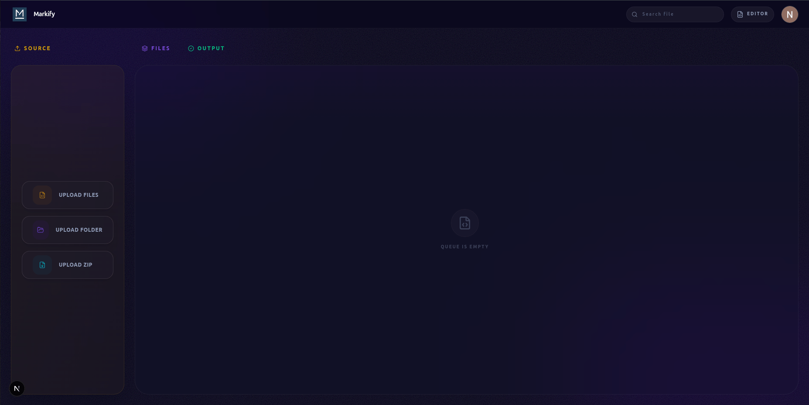

<div align="center">
  
  <h1>Markify</h1>
  <p>Professional Markdown to PDF Conversion Suite</p>
</div>

Markify is a professional, high-performance web application designed to convert Markdown into beautiful, high-fidelity PDF reports. Built with **Next.js**, **Playwright**, and **Tailwind CSS v4**, it features real-time preview, image support, and seamless Mermaid diagram support.

<div align="center">
  <br />
  
  <br />
</div>


## ✨ Core Features

- **📄 Pro PDF Generation**: High-fidelity PDF output using Playwright engine.
- **📊 Mermaid Support**: Native support for diagrams and charts within Markdown.
- **📝 Live Preview**: Real-time side-by-side rendering as you type.
- **🖼️ Image Support**: Seamless rendering of local images.
- **🔐 Secure Auth**: Seamless Google OAuth integration with NextAuth.js v5.
- **📁 File Management**: Robust storage and organization of your documents.
- **🎨 Elite UI**: Stunning dark-mode interface built with Shadcn UI.
- **🐳 Docker Ready**: Fully containerized for instant deployment.

---

## 📸 Interface In Action

### Intelligent Workspace
Real-time side-by-side editing with instant feedback, local image rendering, and diagram support.


<br />

### Batch Processing Pipeline
Convert entire folders, extensive archives, or multiple files into polished PDFs in seconds.



<br />

---

## 🛠️ Technology Stack

- **Framework**: [Next.js 16](https://nextjs.org/)
- **Core Library**: [React 19](https://react.dev/)
- **Language**: [TypeScript](https://www.typescriptlang.org/)
- **Styling**: [Tailwind CSS v4](https://tailwindcss.com/)
- **UI Components**: [Shadcn UI](https://ui.shadcn.com/)
- **Icons**: [Lucide React](https://lucide.dev/)
- **Database**: [PostgreSQL](https://www.postgresql.org/)
- **ORM**: [Prisma](https://www.prisma.io/)
- **Authentication**: [NextAuth.js v5](https://authjs.dev/)
- **PDF Engine**: [Playwright](https://playwright.dev/)
- **State Management**: [Zustand](https://github.com/pmndrs/zustand)
- **Containerization**: [Docker](https://www.docker.com/)

---

## 🚀 Installation & Setup

Markify uses a hybrid setup: Docker for services (Database) and either Docker or local Node.js for the application.

### 1. Prerequisites

Ensure you have the following installed:

- **Node.js 20+**
- **Docker** and **Docker Compose**
- **Git**

### 2. Setup Playwright

Install the necessary browser binaries for PDF generation (Only required for local development):

```bash
npx playwright install chromium
sudo npx playwright install-deps chromium  # Linux only
```

### 3. Configuration

Clone the repository and create your environment configuration:

```bash
cp .env.example .env
```

Open `.env` and configure the following:

#### 1. ⚙️ App Configuration
Essential settings for the application server.
- `NEXTAUTH_URL`: The base URL of your application. Defaults to `http://localhost:3000`.
- `AUTH_TRUST_HOST`: Required for authentication to work inside Docker. Defaults to `true`.
- `AUTH_SECRET`: Run `openssl rand -base64 32` in your terminal and paste the output string here.

#### 2. 🌐 Google OAuth
To enable user login, you must set up Google OAuth:
- Go to [Google Cloud Console](https://console.cloud.google.com/) and create a new project.
- Navigate to **APIs & Services** > **Credentials** > **Create Credentials** > **OAuth client ID**.
- Select **Web application** as the application type.
- Fill in the **App Name**
- Under **Authorized redirect URIs**, add: `http://localhost:3000/api/auth/callback/google`
- Click **Create**.
- Copy the **Client ID** and **Client Secret** into the `GOOGLE_CLIENT_ID` and `GOOGLE_CLIENT_SECRET` fields in your `.env` file.

#### 3. 🗄️ Database Configuration
Settings for the PostgreSQL database connection. **All have workable defaults.**
- `POSTGRES_USER`: Database username.
- `POSTGRES_PASSWORD`: Database password.
- `POSTGRES_DB`: Name of the database.
- `DATABASE_URL`: Full connection string for local development.

#### 4. 🐳 Docker Configuration
Configuration for container-to-container communication. **All have workable defaults.**
- `DOCKER_DATABASE_URL`: Connection string used by the app container to reach the database container.
- `APP_CONTAINER_NAME`: Name for the application service container.
- `DB_CONTAINER_NAME`: Name for the database service container.

#### 5. 👤 PgAdmin Configuration
Credentials for the PgAdmin database management interface. **All have workable defaults.**
- `PGADMIN_DEFAULT_EMAIL`: Email for PgAdmin login.
- `PGADMIN_DEFAULT_PASSWORD`: Password for PgAdmin login.

### 4. Initial Installation

Run the setup command to install dependencies, build containers, and sync the database schema.

```bash
make setup
```

### 5. Running the Application

Choose the method that fits your needs:

#### Option A: Docker Environment
Runs the entire application suite in Docker containers.

```bash
make up
```

#### Option B: Local Development
Runs the app locally with hot-reloading enabled, connected to the Dockerized database. Best for coding.

```bash
make dev
```

> **Access the app at:** [http://localhost:3000](http://localhost:3000)

---

<div align="center">
  
  <p>Built with ❤️ by the <b>KAI</b></p>
</div>
