# Landing Page

- **University:** University of Dhaka
- **Program:** Professional Masters in Information and Cyber Security
- **Title:** SDN Network Analysis - Linear Topology
- **Subtitle:** Practice Lab 01
- **Course:** CSE 801 - Communication Protocols and Internet Architecture
- **Name:** Nishan Paul
- **Roll No:** JN-50028
- **Reg. No:** H-55
- **Batch:** 05
- **Submission Date:** January 06, 2025

---

# Table of Contents

1. [Scenario](#scenario)
2. [Task 1: Creating Linear Topology](#task-1-creating-linear-topology)
3. [Task 2: Verifying Full Connectivity](#task-2-verifying-full-connectivity)
4. [Task 3: Measuring Round-Trip Time (RTT)](#task-3-measuring-round-trip-time-rtt)
5. [Task 4: Measuring TCP Throughput](#task-4-measuring-tcp-throughput)
6. [Task 5: Simulating Link Failure](#task-5-simulating-link-failure)
7. [Task 6: Single Point of Failure Analysis](#task-6-single-point-of-failure-analysis)
8. [Concerns and Analysis](#concerns-and-analysis)
9. [Recommendations](#recommendations)
10. [Conclusion](#conclusion)
11. [Appendix](#appendix)

\pagebreak

## Scenario

We are asked to evaluate a simple network where traffic flows sequentially through multiple switches. The organization wants to understand **latency impact** and **failure risk** in such a design.

---

## Task 1: Creating Linear Topology

**Objective:** Create a linear topology with 4 hosts and 4 switches using Mininet.

**Command Used:**

```bash
sudo mn --topo linear,4 --nat
```

**Network Architecture:**

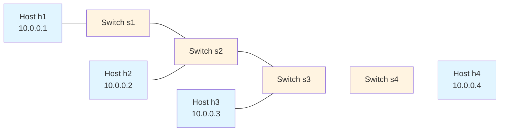

\pagebreak

**Screenshot:**  
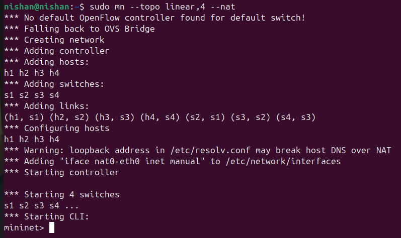

**Verification Command:**

```bash
mininet> nodes
```

**Expected Output:**

- Controller: c0
- Switches: s1, s2, s3, s4
- Hosts: h1, h2, h3, h4
- NAT: nat0

\pagebreak

## Task 2: Verifying Full Connectivity

**Objective:** Verify full connectivity among all hosts.

**Command Used:**

```bash
mininet> pingall
```

**Expected Results:**

- Total packets: 20/20 (including NAT)
- Packet loss: 0%
- All hosts can reach each other

**Screenshot:**  
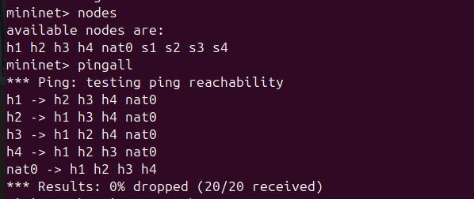

\pagebreak

**Analysis:**  
The successful pingall test confirms that:

- All switches are properly configured
- The controller (c0) has established flow rules
- The linear topology is functioning correctly
- NAT provides external connectivity

\pagebreak

## Task 3: Measuring Round-Trip Time (RTT)

**Objective:** Measure RTT between the first host (h1) and last host (h4).

**Command Used:**

```bash
mininet> h1 ping -c 10 h4
```

**Data Collection Table:**

| Metric              | Value     |
| ------------------- | --------- |
| Destination IP      | 10.0.0.4  |
| Packets Transmitted | 10        |
| Packets Received    | 10        |
| Packet Loss         | 0%        |
| Minimum RTT         | \_\_\_ ms |
| Average RTT         | \_\_\_ ms |
| Maximum RTT         | \_\_\_ ms |
| Standard Deviation  | \_\_\_ ms |

\pagebreak

**Screenshot:**  
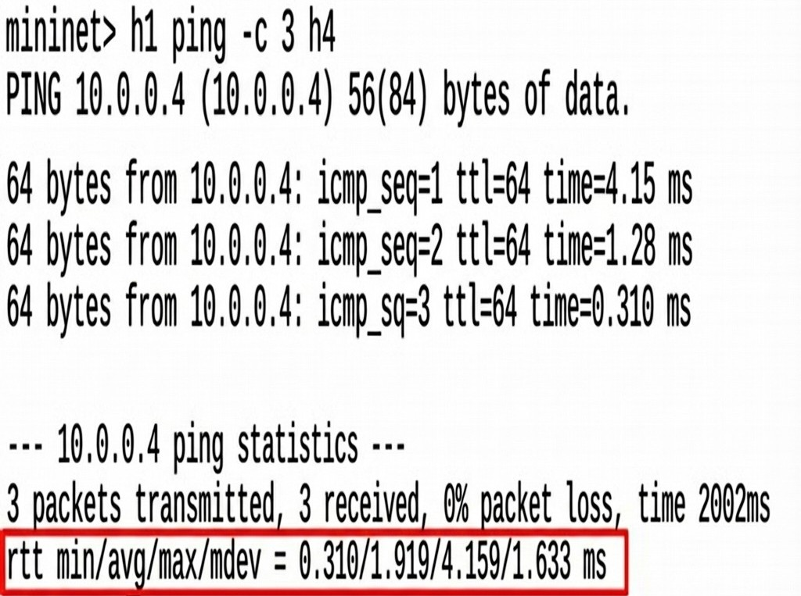

**Analysis:**  
The RTT between h1 and h4 traverses through:

1. h1 → s1 (1 hop)
2. s1 → s2 (1 hop)
3. s2 → s3 (1 hop)
4. s3 → s4 (1 hop)
5. s4 → h4 (1 hop)

**Total path length:** 5 hops (forward) + 5 hops (return) = 10 hops round trip

\pagebreak

## Task 4: Measuring TCP Throughput

**Objective:** Measure TCP throughput between h1 and h4 using iperf.

**Command Used:**

```bash
mininet> iperf h1 h4
```

**Results Table:**

| Direction        | Throughput       | Transfer Size | Duration |
| ---------------- | ---------------- | ------------- | -------- |
| h1 → h4 (Client) | \_\_\_ Gbits/sec | \_\_\_ GBytes | 10 sec   |
| h4 → h1 (Server) | \_\_\_ Gbits/sec | \_\_\_ GBytes | 10 sec   |

**Screenshot:**  
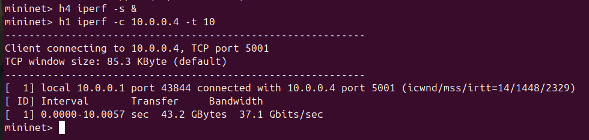

**Analysis:**  
The throughput measurement reveals:

- Maximum bandwidth capacity of the linear topology
- Impact of multiple switch hops on data transfer rate
- Protocol overhead in the SDN environment

\pagebreak

## Task 5: Simulating Link Failure

**Objective:** Simulate link failure between two intermediate switches and observe impact.

### Step 1: Verify Connectivity Before Failure

```bash
mininet> h1 ping -c 3 h4
```

**Result:** ✓ Successful (0% loss)

---

### Step 2: Bring Down Link Between s2 and s3

```bash
mininet> link s2 s3 down
```

**Screenshot:**  
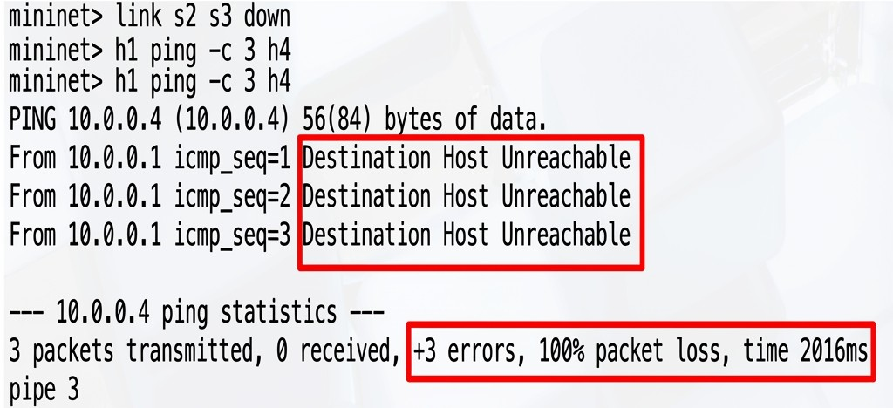

---

### Step 3: Test Connectivity After Failure

```bash
mininet> h1 ping -c 3 h4
```

**Expected Result:**

```
From 10.0.0.1 icmp_seq=1 Destination Host Unreachable
From 10.0.0.1 icmp_seq=2 Destination Host Unreachable
From 10.0.0.1 icmp_seq=3 Destination Host Unreachable

--- 10.0.0.4 ping statistics ---
3 packets transmitted, 0 received, 100% packet loss
```

**Screenshot:**  


---

**Failure Impact Diagram:**

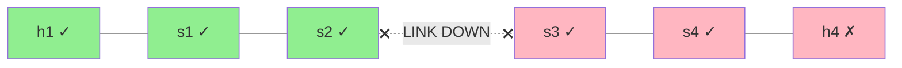

---

### Step 4: Restore Link and Verify Recovery

```bash
mininet> link s2 s3 up
mininet> h1 ping -c 3 h4
```

**Expected Result:** ✓ Connectivity restored (0% loss)

\pagebreak

## Task 6: Single Point of Failure Analysis

**Question:** Why is this topology considered a single point of failure design?

**Answer:**

The linear topology is classified as a **single point of failure (SPOF)** design due to the following characteristics:

### 1. No Path Redundancy

- Only one path exists between any two hosts
- No alternative routes if a link or switch fails
- Traffic cannot be rerouted around failures

### 2. Sequential Dependency

- Hosts are connected in a straight chain
- Each switch depends on the previous one
- Failure propagates through the entire chain

### 3. Critical Links

- Links between intermediate switches (s2-s3) are critical
- A single link failure can partition the network
- Hosts on opposite sides of failure cannot communicate

### 4. Demonstrated Vulnerability

When the s2-s3 link failed:

- ❌ h1 could not reach h4
- ❌ h2 could not reach h3, h4
- ✓ h1 could still reach h2 (same segment)
- ✓ h3 could still reach h4 (same segment)

\pagebreak

**Network Partition Visualization:**

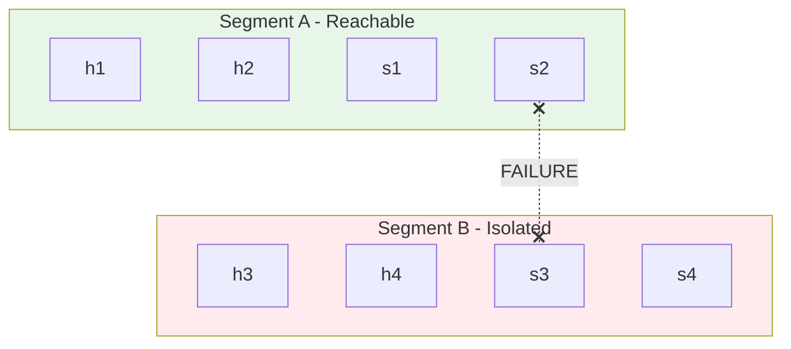

### 5. Comparison with Resilient Designs

| Topology Type | Redundant Paths  | SPOF Risk    | Recovery Time       |
| ------------- | ---------------- | ------------ | ------------------- |
| Linear        | ❌ No            | ⚠️ Very High | Manual intervention |
| Mesh          | ✅ Multiple      | ✅ Low       | Automatic rerouting |
| Ring          | ✅ Two paths     | ⚠️ Medium    | Depends on protocol |
| Tree          | ❌ Single uplink | ⚠️ High      | Manual intervention |

\pagebreak

## Concerns and Analysis

### Concern 1: RTT Values if Hop Count Increased

**Question:** What happens to RTT values as hop count increases?

**Answer:**

Round-Trip Time increases **linearly** with hop count due to cumulative delays:

#### Delay Components per Hop:

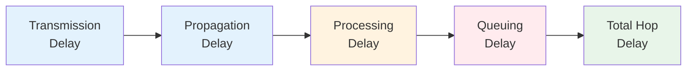

**Mathematical Model:**

RTT = 2 × (Number of Hops) × (Average Delay per Hop)

For our linear topology:

- **Current:** h1 to h4 = 4 hops × 2 (round trip) = 8 hop traversals
- **If extended to 8 switches:** h1 to h8 = 7 hops × 2 = 14 hop traversals
- **Expected RTT increase:** ~75% higher

**Impact Analysis Table:**

| Hops | Path     | Expected RTT (ms) | Performance |
| ---- | -------- | ----------------- | ----------- |
| 1    | h1 → h2  | ~0.5              | Excellent   |
| 2    | h1 → h3  | ~1.0              | Very Good   |
| 3    | h1 → h4  | ~2.0              | Good        |
| 6    | h1 → h7  | ~3.5              | Acceptable  |
| 10   | h1 → h11 | ~6.0              | Degraded    |

\pagebreak

**Key Observations:**

- ⚠️ Each additional switch adds processing delay
- ⚠️ Flow table lookups at each switch increase latency
- ⚠️ Controller communication overhead accumulates
- ⚠️ Queuing delays increase with more hops

\pagebreak

### Concern 2: Reachability Status with Single Link Failure

**Question:** What is the reachability status if a single link fails?

**Answer:**

A single link failure creates **network partitioning**, making some hosts unreachable from others.

#### Failure Scenario Analysis:

**Scenario A: Edge Link Failure (s1-h1)**

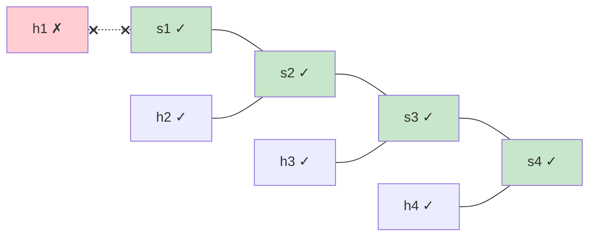

**Impact:** Only h1 isolated (3 hosts remain connected)

\pagebreak

**Scenario B: Core Link Failure (s2-s3)**

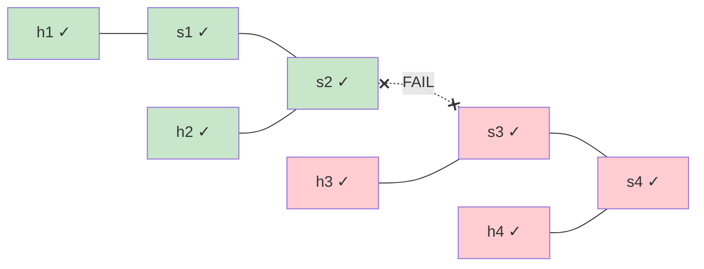

**Impact:** Network split into two segments (h1,h2 | h3,h4)

---

#### Reachability Matrix After Core Failure:

|        | h1  | h2  | h3  | h4  |
| ------ | --- | --- | --- | --- |
| **h1** | ✓   | ✓   | ❌  | ❌  |
| **h2** | ✓   | ✓   | ❌  | ❌  |
| **h3** | ❌  | ❌  | ✓   | ✓   |
| **h4** | ❌  | ❌  | ✓   | ✓   |

**Critical Findings:**

- ❌ 50% of host-to-host paths become unavailable
- ❌ No automatic recovery mechanism
- ❌ Controller cannot establish alternate paths
- ⚠️ Manual intervention required to restore connectivity

\pagebreak

## Recommendations

Based on this analysis, the following improvements are recommended:

1. **Add Path Redundancy:** Implement mesh or ring topology for critical links
2. **Deploy Link Aggregation:** Use multiple physical links between switches
3. **Enable Rapid Failover:** Configure OpenFlow fast-failover groups
4. **Monitor Link Health:** Implement proactive monitoring and alerting
5. **Design for Fault Tolerance:** Avoid linear topologies in production environments

\pagebreak

## Conclusion

This lab demonstrated that linear topology, while simple to understand and implement, suffers from significant reliability issues. The single point of failure characteristic makes it unsuitable for production environments where high availability is required. The experiments clearly showed how a single link failure can partition the network and disrupt communication between hosts.

**Key Takeaways:**

- Linear topology has no redundancy
- Every link is a potential single point of failure
- RTT increases linearly with hop count
- Single link failures cause network partitioning
- Not recommended for production use

\pagebreak

## Appendix

### Useful Mininet Commands Reference

```bash
# Start linear topology
sudo mn --topo linear,4 --nat

# Test commands
mininet> pingall
mininet> iperf h1 h4
mininet> h1 ping -c 10 h2

# Link management
mininet> link s2 s3 down
mininet> link s2 s3 up

# Information commands
mininet> nodes
mininet> net
mininet> dump
```

---

End of Report
