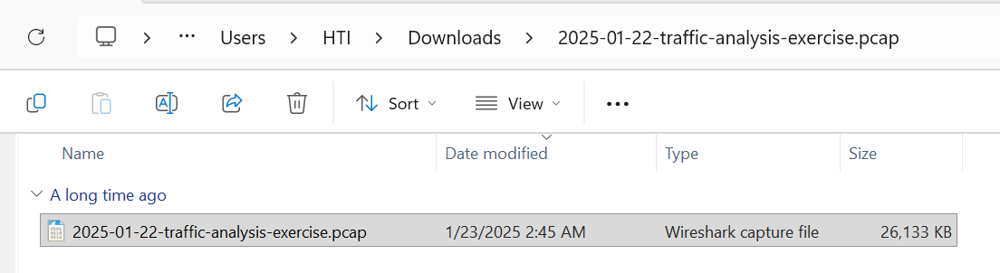
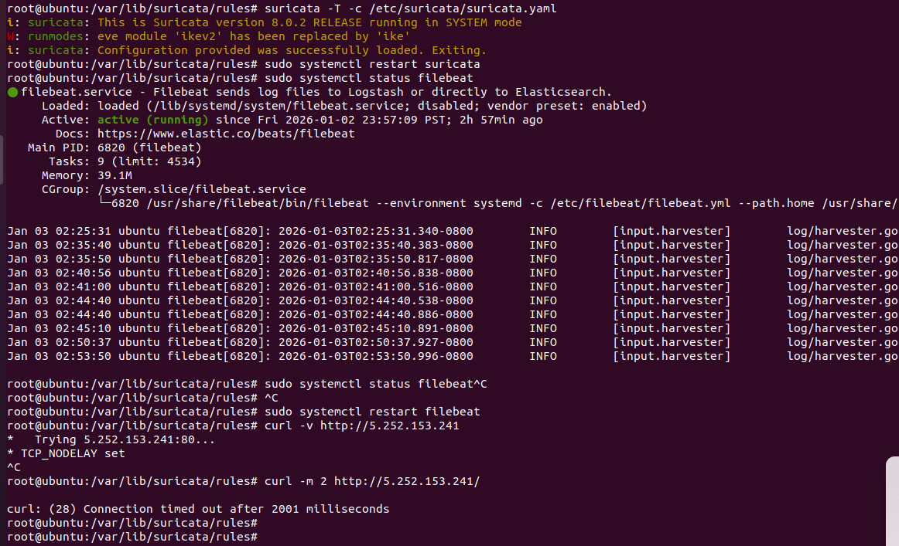
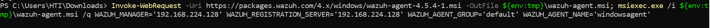
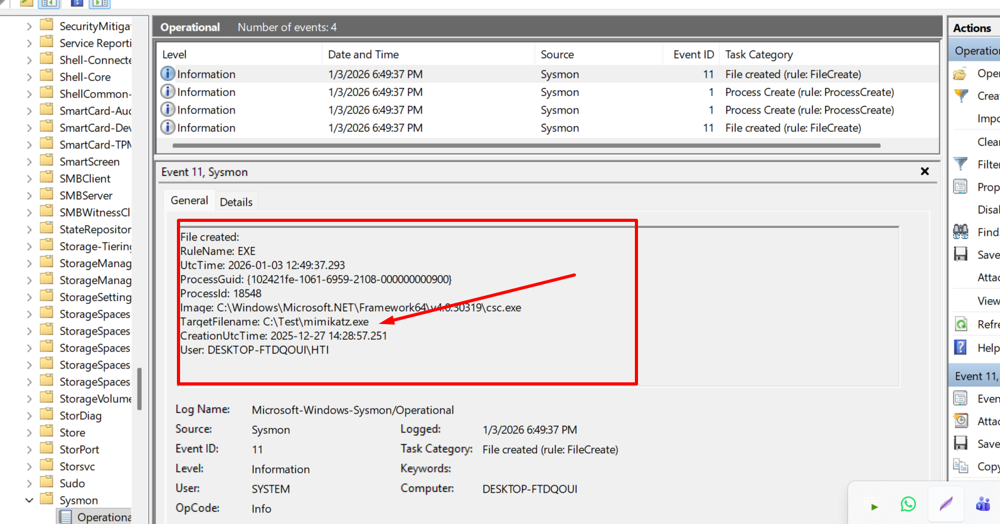
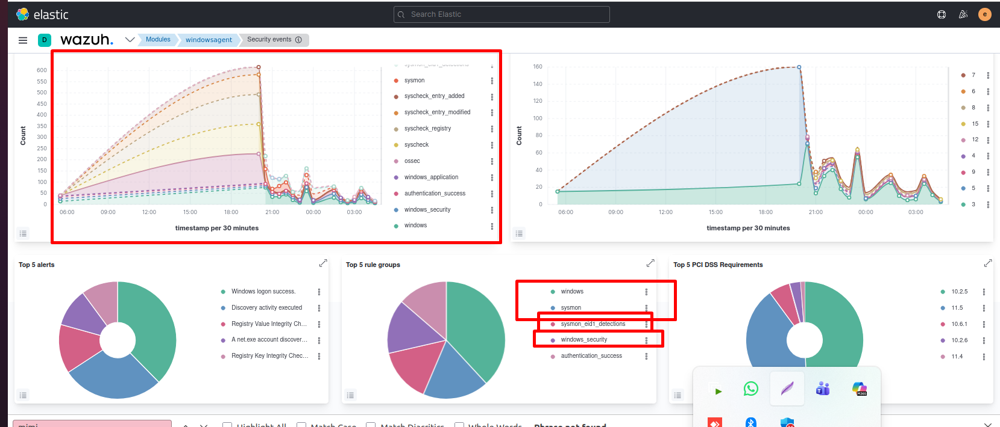

# Landing Page

- **University:** University of Dhaka
- **Program:** Professional Master’s in Information & Cybersecurity (PMICS)
- **Title:** CSE 804 (2nd Mid on Lab)
- **Subtitle:** Network Traffic Analysis, Threat Mitigation & EDR Integration
- **Course:** CSE 804: Network & Internet Security
- **Name:** Nishan Paul
- **Roll No:** 50028
- **Reg. No:** H-55
- **Batch:** 05
- **Submission Date:** January 17, 2026

**Collaborative Group Members:**
| Name | Roll Number |
| :--- | :--- |
| Md Rakibur Rahman | 50040 |
| Anado Shaffat | 50004 |
| Md Hossain Sarwar | 50036 |
| Md Ranik Miah | 50017 |

\pagebreak

# Table of Contents
1. [Forensic Network Traffic Analysis & Defensive Signature Development](#section-1-forensic-network-traffic-analysis--defensive-signature-development)
   - [1.1 Analysis Context & Scenario](#11-analysis-context--scenario)
   - [1.2 Task Objective & Requirement](#12-task-objective--requirement)
   - [1.3 Technical Execution: Traffic Forensics](#13-technical-execution-traffic-forensics)
   - [1.4 Defense Implementation: Suricata NIDS Development](#14-defense-implementation-suricata-nids-development)
   - [1.5 Validation & Monitoring](#15-validation--monitoring)
2. [Active Threat Mitigation & Host-Level Enforcement](#section-2-active-threat-mitigation--host-level-enforcement)
   - [2.1 Task Objective & Requirement](#21-task-objective--requirement)
   - [2.2 Implementation: Host Isolation using IPTables](#22-implementation-host-isolation-using-iptables)
   - [2.3 Post-Mitigation Validation](#23-post-mitigation-validation)
3. [EDR Integration & Advanced Endpoint Monitoring](#section-3-edr-integration--advanced-endpoint-monitoring)
   - [3.1 Task Objective & Strategy](#31-task-objective--strategy)
   - [3.2 Technical Setup: Wazuh & Sysmon Integration](#32-technical-setup-wazuh--sysmon-integration)
   - [3.3 Configuration: High-Fidelity Process Monitoring](#33-configuration-high-fidelity-process-monitoring)
   - [3.4 Simulation & Detection Validation](#34-simulation--detection-validation)
4. [Executive Summary & Conclusion](#executive-summary--conclusion)

\pagebreak

## SECTION 1: Forensic Network Traffic Analysis & Defensive Signature Development

### **1.1 Analysis Context & Scenario**
The investigation focuses on a real-world infection scenario sourced from the forensic repository **malware-traffic-analysis.net**.

*   **Case Reference:** 2025-01-22 - DOWNLOAD FROM FAKE SOFTWARE SITE
*   **Evidence Source:** `2025-01-22-traffic-analysis-exercise.pcap.zip`
*   **Security Threat:** An unsuspecting user downloaded a malicious object from a search engine result (Google Authenticator search) which triggered a Stage-1 PowerShell execution script (`.ps1`).

---

### **1.2 Task Objective & Requirement**
> **Question 1:** *You need to create a custom Suricata signature which will trigger an alert for any type of HTTP communication to this public IP.*

**Technical Goal:** Perform deep packet inspection to identify the malicious source IP, then develop a custom Signature for the Suricata Network IDS to automate future detection.

---

### **1.3 Technical Execution: Traffic Forensics**
We utilized **Wireshark** to parse the forensic data. To identify the infection vector, we prioritized searching for Stage-1 execution scripts. Since PowerShell is a common vector for initial execution (**MITRE T1059.001**), we utilized the display filter `http.request.uri contains ".ps1"`. 




The search isolated two distinct HTTP GET requests aimed at retrieving PowerShell scripts. A secondary filter, `http.response && frame contains ".ps1"`, confirmed that the malicious payloads were effectively delivered to the victim host.


Using the **Export Objects** feature, we confirmed the download source as the public IP **5.252.153.241**.


---

### **1.4 Defense Implementation: Suricata NIDS Development**
Having established **5.252.153.241** as a malicious endpoint, we deployed a multi-stage rule in the **Suricata** sensor.

**SOC Engineering Strategy:** 
We implemented both a broad detection rule and an advanced threshold-based rule to reduce "alert fatigue" during potential scanning events.

```bash
# [Basic Detection] Triggers on any standard HTTP attempt to the C2
alert tcp any any -> 5.252.153.241 80 (msg:"TCP connection attempt to 5.252.153.241 detected"; sid:1000002; rev:1;)

# [Production Standard] Implements thresholding for high-fidelity alerting
echo "alert tcp $HOME_NET any -> 5.252.153.241 any (msg:\"IOC: Connection attempt to known suspicious IP\"; flags:S; threshold:type both, track by_src, count 2, seconds 120; classtype:trojan-activity; sid:1000001; rev:1;)" > rakibcustom.rules
```


---

### **1.5 Validation & Monitoring**
Post-restart of the Suricata and Filebeat services, we verified the configuration through manual traffic simulation using `wget`.



The **Elasticsearch** dashboard successfully captured the alerts, categorizing them under **"Trojan Activity"**, providing the SOC team with clear visibility into the threat activity.


---

## SECTION 2: Active Threat Mitigation & Host-Level Enforcement

### **2.1 Task Objective & Requirement**
> **Question 2:** *You need to block any communication toward this IOC from Q1.*

**Security Goal:** Establish an immediate "deny-all" boundary to isolate the compromised host from the attacker's Command and Control (C2) infrastructure.

---

### **2.2 Implementation: Host Isolation using IPTables**
To prevent data exfiltration (**MITRE T1041**) or secondary stage drops, we enforced a strict firewall policy. By using **REJECT** instead of **DROP**, we provide a clear reset to any pending stateful connections.

```bash
# Enforcement: Block all Inbound and Outbound traffic to the IOC sessions
sudo iptables -A INPUT -s 5.252.153.241 -j REJECT
sudo iptables -A OUTPUT -d 5.252.153.241 -j REJECT
```


---

### **2.3 Post-Mitigation Validation**
We performed verified connectivity tests to ensures the host was no longer vulnerable to outbound C2 communication. All attempts reached an immediate "Connection Refused" state.


---

## SECTION 3: EDR Integration & Advanced Endpoint Monitoring

### **3.1 Task Objective & Strategy**
The final objective was the deployment of an **Endpoint Detection and Response (EDR)** pipeline. We focused on monitoring **LSASS (Local Security Authority Subsystem Service)**, which is the primary target for credential harvesting (**MITRE T1003.001**).

---

### **3.2 Technical Setup: Wazuh & Sysmon Integration**
We deployed the **Wazuh Agent** on the target Windows 11 machine for centralized telemetry.


The deployment was automated via the following PowerShell command to ensure immediate linkage to the SIEM cluster:

```powershell
Invoke-WebRequest -Uri https://packages.wazuh.com/4.x/windows/wazuh-agent-4.5.4-1.msi -OutFile ${env:tmp}\wazuh-agent.msi; msiexec.exe /i ${env:tmp}\wazuh-agent.msi /q WAZUH_MANAGER='192.168.224.128' WAZUH_REGISTRATION_SERVER='192.168.224.128' WAZUH_AGENT_GROUP='default' WAZUH_AGENT_NAME='windowsagent'
```




---

### **3.3 Configuration: High-Fidelity Process Monitoring**
We utilized **Sysmon** to monitor **Event ID 10 (ProcessAccess)**. By identifying unauthorized processes attempting to read the memory space of `lsass.exe`, we can detect credential dumping attempts in real-time.



**Expert-Level Optimization:**
The exclusion logic below ensures that standard Windows processes (like `svchost.exe`) do not trigger false alerts, preserving system performance.

```xml
<!-- Critical Rule: Mitigating Credential Theft Attempts -->
<RuleGroup name="ProcessAccessToLSASS" groupRelation="and">
 <ProcessAccess onmatch="include">
  <TargetImage condition="is">C:\Windows\System32\lsass.exe</TargetImage>
 </ProcessAccess>
 ... [Noise reduction logic for stability] ...
</RuleGroup>
```


---

### **3.4 Simulation & Detection Validation**
To verify our "Defense in Depth" strategy, we simulated a **Mimikatz** credential dumping attack.


The detection pipeline successfully triggered high-priority alerts in the Wazuh dashboard, confirming our ability to detect memory-resident threats.




---

## EXECUTIVE SUMMARY & CONCLUSION

This report presents a verified, multi-layered security response to a verified malware infection event. By combining **Network Analysis (Wireshark)**, **Traffic Enforcement (Suricata/IPTables)**, and **Behavioral Endpoint Monitoring (Wazuh/Sysmon)**, we have demonstrated a full-cycle Incident Response workflow.

The core success of this project lies in **Defense in Depth**: identifying threats at the network boundary while maintaining deep visibility into the endpoint to prevent high-impact actions like credential theft. This approach represents the gold standard for protecting a modern enterprise against sophisticated cyber-attacks.
