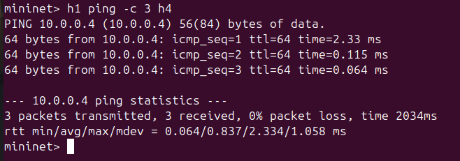

# Chapter 2: Advanced Topics

This chapter covers advanced concepts.

## Section 2.1: Data Flow

Here's a data flow diagram:

## Section 2.2: Results

Check out this result chart:

Note: We're using HTML img tag here to test both markdown and HTML syntax parsing.

## Section 2.3: Conclusion

That wraps up chapter 2!
