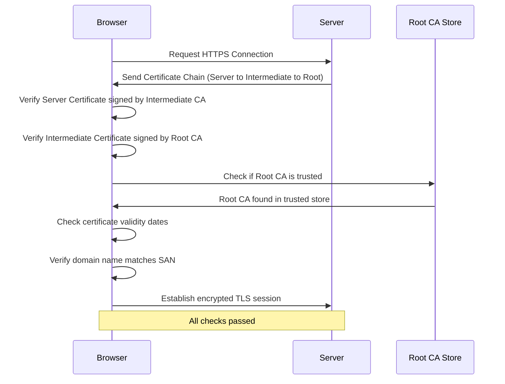
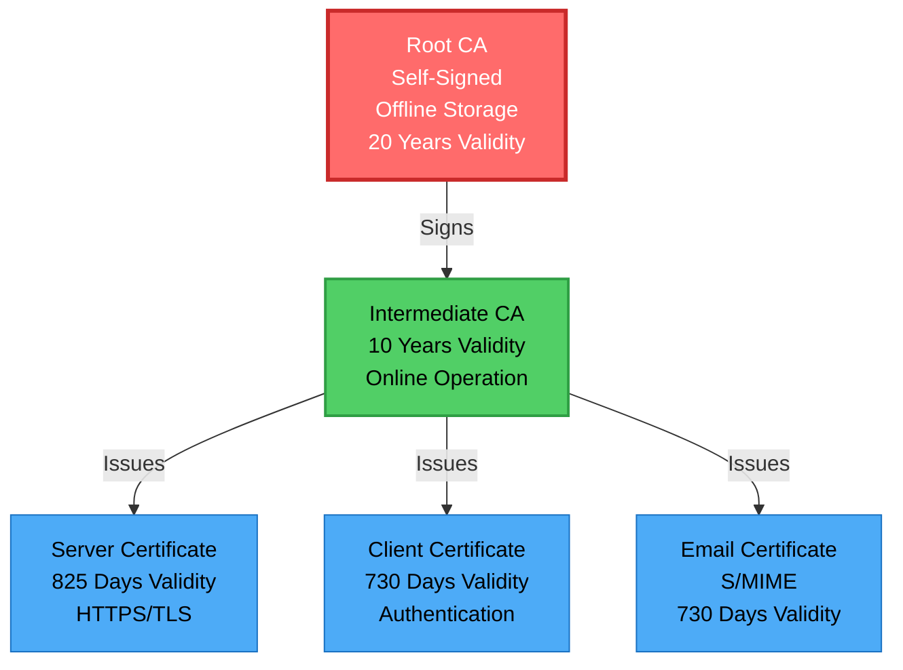
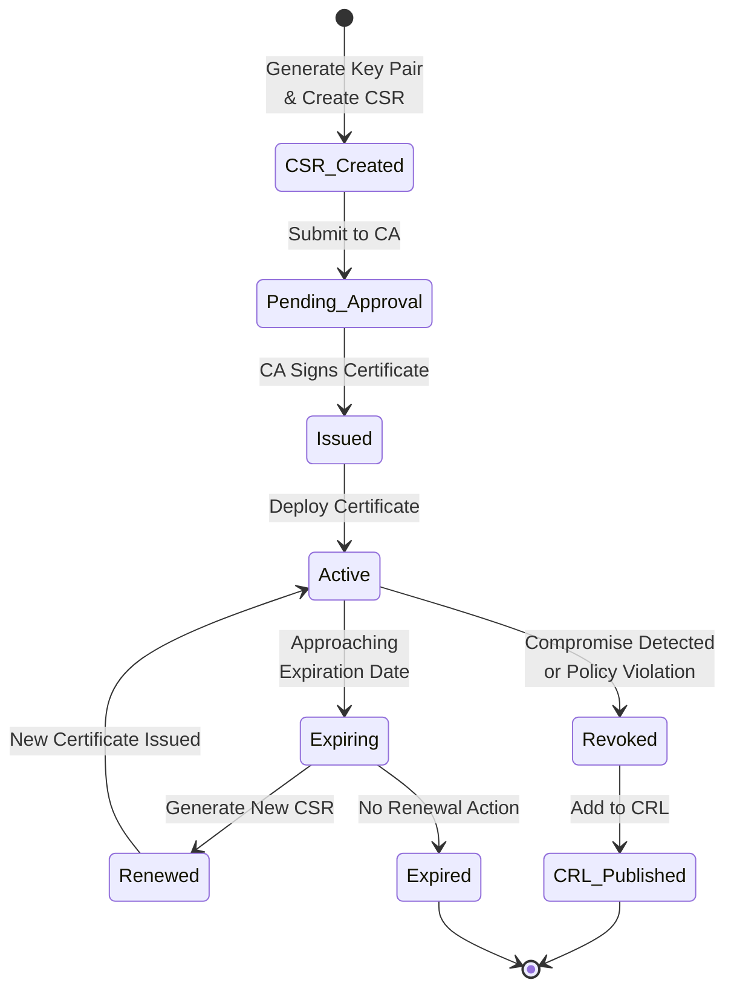
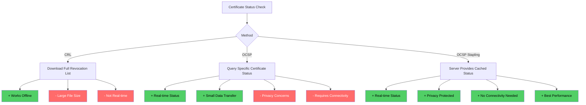
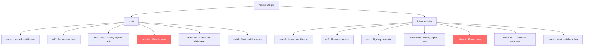
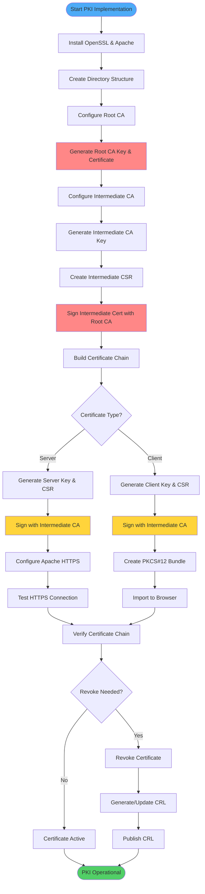
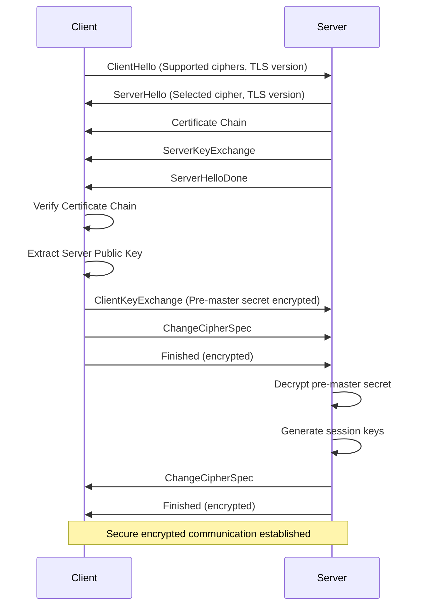
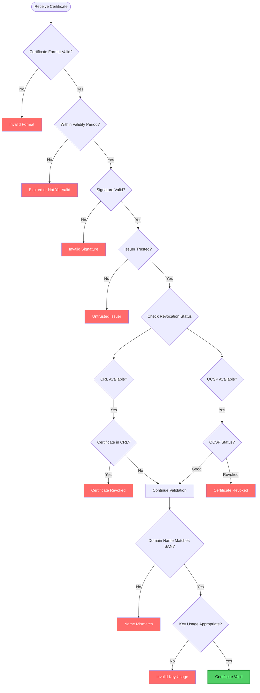
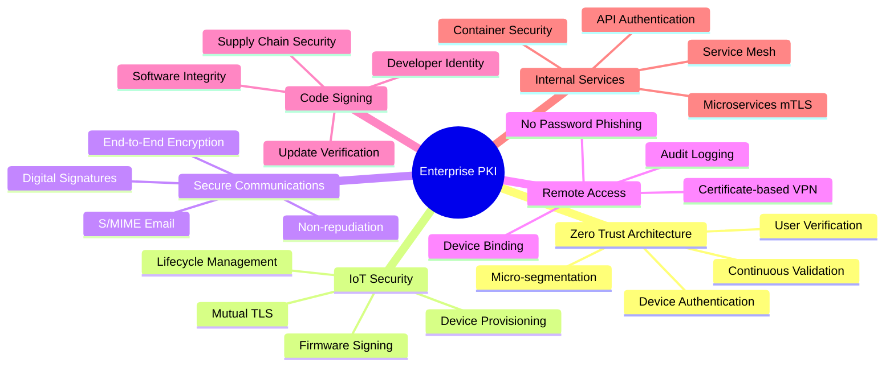
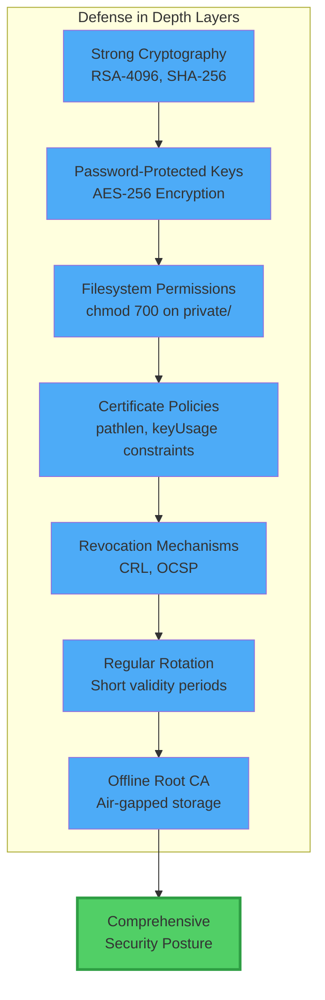

## Table of Contents

1. [Introduction](#introduction)
2. [Understanding Public Key Infrastructure](#understanding-public-key-infrastructure)
3. [PKI Architecture and Components](#pki-architecture-and-components)
4. [Implementation Environment](#implementation-environment)
5. [Building the PKI Step-by-Step](#building-the-pki-step-by-step)
6. [Testing and Verification](#testing-and-verification)
7. [Conclusion](#conclusion)
8. [Appendix: Quick Reference](#appendix-quick-reference-commands)

## Introduction

In today's digital world, trust is everything. When you visit a website with HTTPS, send encrypted emails, or connect to a corporate VPN, there's an invisible infrastructure working behind the scenes to ensure that your communication is secure and that you're really talking to who you think you're talking to. This infrastructure is called **Public Key Infrastructure, or PKI**.

Think of PKI as a digital identity system—similar to how governments issue passports to verify citizens' identities, PKI uses digital certificates to verify the identity of websites, users, devices, and services. But unlike a single government authority, PKI operates through a chain of trust, where multiple Certificate Authorities work together to establish and maintain security.

This report documents my journey in building a fully functional Mini PKI from scratch. Throughout this implementation, I've learned not just the technical commands, but the reasoning behind each decision—why we need intermediate CAs, how certificate chains work, and why revocation mechanisms are critical for maintaining security.

## Understanding Public Key Infrastructure

### What is PKI?

Public Key Infrastructure is a comprehensive framework that combines people, policies, processes, hardware, software, and cryptographic techniques to create, manage, distribute, use, store, and revoke digital certificates. At its core, PKI enables secure communication in an insecure world by solving two fundamental problems:

1. **Authentication:** How do we prove that someone is who they claim to be?
2. **Encryption:** How do we ensure that our messages can only be read by the intended recipient?

PKI solves these problems using **asymmetric cryptography**, where each entity has a pair of mathematically related keys: a **public key** (which anyone can see) and a **private key** (which must be kept secret). Data encrypted with the public key can only be decrypted with the corresponding private key, and vice versa.

### The Trust Problem

Imagine you're visiting an online banking website. The website sends you its public key and says, "Use this to encrypt your password." But how do you know this public key actually belongs to your bank and not to a malicious attacker? This is where digital certificates come in.

A **digital certificate** is like a digitally signed document that says, "This public key belongs to example.com, and I (a trusted Certificate Authority) verified it." The certificate is signed by the CA's private key, and anyone can verify this signature using the CA's public key. This creates a **chain of trust**.



### Why PKI Matters

PKI is the foundation of internet security. Every time you see the padlock icon in your browser, PKI is at work. It's used in:

- **HTTPS websites:** Ensuring you're connected to the real website, not a phishing clone
- **Email encryption (S/MIME):** Protecting sensitive communications
- **VPNs:** Authenticating remote users before granting network access
- **Code signing:** Verifying software hasn't been tampered with
- **IoT devices:** Establishing secure device-to-device communication
- **Enterprise networks:** Implementing Zero Trust security architectures

## PKI Architecture and Components



A well-designed PKI isn't a single monolithic system—it's a carefully architected hierarchy that balances security with operational efficiency.

### Root Certificate Authority (Root CA)

The Root CA sits at the top of the PKI hierarchy and serves as the ultimate trust anchor. Think of it as the supreme court of the digital identity world—its decisions are final, and everyone trusts it implicitly.

**Key characteristics:**

- **Self-signed certificate:** The Root CA signs its own certificate, making it the starting point of trust
- **Long validity period:** Typically 10-20 years, as replacing a Root CA is extremely disruptive
- **Highly protected:** Should be kept offline in a Hardware Security Module (HSM) or air-gapped system
- **Minimal usage:** Only used to sign Intermediate CA certificates, not end-entity certificates

**Why keep it offline?** If a Root CA is compromised, the entire PKI collapses. Every certificate issued by that Root becomes untrustworthy. By keeping it offline, we dramatically reduce the attack surface.

### Intermediate Certificate Authority

The Intermediate CA is where the security philosophy of "defense in depth" comes into play. Rather than having the Root CA directly issue certificates to servers and users (which would require keeping it online and exposed), we introduce an intermediate layer.

**Why use an Intermediate CA?**

1. **Security isolation:** If the Intermediate CA is compromised, we can revoke just that intermediate certificate without affecting the Root CA
2. **Operational flexibility:** The Intermediate CA can be kept online for day-to-day operations while the Root remains secure
3. **Scalability:** Large organizations can have multiple Intermediate CAs for different purposes
4. **Geographical distribution:** Different regions or departments can have their own Intermediate CAs

**Key characteristics:**

- Signed by the Root CA
- Medium validity period (3-5 years)
- Can be kept online but should still be well-protected
- Issues certificates to end entities (servers, clients, users)

### Server Certificates

Server certificates are what most people encounter daily when browsing the web. When you visit `https://example.com`, the web server presents a certificate that proves it's the legitimate example.com and not an imposter.

**What makes a server certificate special?**

- **Subject Alternative Names (SANs):** Modern certificates include multiple domain names and IP addresses
- **Extended Key Usage:** Marked specifically for server authentication (serverAuth)
- **Key encipherment:** Enables the server to establish encrypted TLS sessions

**When a browser connects to an HTTPS website:**

1. The server sends its certificate
2. The browser verifies the certificate chain (Server → Intermediate → Root)
3. The browser checks that the Root CA is in its trusted store
4. The browser verifies the certificate hasn't expired or been revoked
5. If all checks pass, a secure encrypted session is established

### Client Certificates

While server certificates prove the identity of servers, client certificates prove the identity of users or devices. This is called **mutual TLS (mTLS)** because both parties authenticate each other.

**Use cases for client certificates:**

- **Corporate VPNs:** Employees use client certificates to authenticate before accessing internal resources
- **Zero Trust networks:** Every device must present a valid certificate
- **Service-to-service authentication:** Microservices authenticate to each other using certificates
- **High-security environments:** Banks and government systems requiring strong authentication

Client certificates provide much stronger security than passwords because:

- They're based on cryptographic keys that can't be guessed
- They're stored on the device, making them harder to steal
- They can be bound to hardware (TPM chips) for additional protection

### Certificate Revocation: The Safety Net

Even with all these security measures, things can go wrong. A private key might be compromised, an employee might leave the company with their certificate still active, or a device might be stolen. This is where certificate revocation becomes critical.



#### Certificate Revocation List (CRL)

A CRL is essentially a blacklist—a file that contains the serial numbers of all revoked certificates. CAs publish updated CRLs periodically (daily or weekly), and clients download them to check if a certificate has been revoked.

**Pros:**
- Simple concept, easy to implement
- Works offline (once downloaded)
- Comprehensive list of all revoked certificates

**Cons:**
- Can become very large for big organizations
- Not real-time (there's a delay between revocation and CRL publication)
- Privacy concerns (downloading the full list reveals which certificates you're checking)

#### Online Certificate Status Protocol (OCSP)

OCSP is the modern, real-time alternative to CRLs. Instead of downloading a large list, the client queries an OCSP server: "Is certificate X still valid?" The server responds with "good," "revoked," or "unknown."

**Pros:**
- Real-time status checking
- Smaller data transfer (only checking one certificate)
- More efficient for mobile devices and embedded systems

**Cons:**
- Requires internet connectivity
- Privacy concerns (the OCSP server knows which certificates you're checking)
- Single point of failure (if OCSP server is down)

Modern implementations often use **OCSP Stapling**, where the server itself periodically fetches its OCSP status and presents it to clients, solving both the privacy and availability concerns.



## Implementation Environment

### System Requirements

For this implementation, I used Kali Linux, which comes with all the necessary cryptographic tools pre-installed. However, the same steps work on Ubuntu, Debian, or any other Linux distribution.

**Required software:**

- **OpenSSL:** The Swiss Army knife of cryptography, used for generating keys, certificates, and managing the CA
- **Apache2:** A widely-used web server that will demonstrate our PKI in action with HTTPS

**Installation:**

```bash
sudo apt update
sudo apt install -y openssl apache2
```

### Why OpenSSL?

OpenSSL is the de facto standard for SSL/TLS implementations. It's open-source, battle-tested, and used by millions of servers worldwide. While there are graphical CA management tools, using OpenSSL directly gives us complete control and a deep understanding of what's happening under the hood.

### Directory Structure Philosophy

A well-organized PKI requires a clear directory structure. Each CA (Root and Intermediate) has its own directory with standardized subdirectories:

- **certs/:** Stores issued certificates
- **crl/:** Contains Certificate Revocation Lists
- **newcerts/:** OpenSSL places newly signed certificates here
- **private/:** Highly sensitive directory containing private keys (permissions set to 700)
- **csr/:** Certificate Signing Requests waiting to be signed

This structure isn't arbitrary—it follows industry best practices and makes it easy to locate and manage certificates throughout their lifecycle.



## Building the PKI Step-by-Step



Now comes the exciting part—actually building our PKI from the ground up.

### Step 1: Setting Up the Environment

```bash
# Update package lists
sudo apt update

# Install OpenSSL and Apache
sudo apt install -y openssl apache2

# Verify installations
openssl version
apache2 -v
```

### Step 2: Creating the Directory Structure

```bash
# Set our PKI directory as an environment variable
export PKI_DIR=/home/kali/pki
mkdir -p "$PKI_DIR"
cd "$PKI_DIR"

# Create Root CA structure
mkdir -p $PKI_DIR/root/{certs,crl,newcerts,private}
chmod 700 $PKI_DIR/root/private
touch $PKI_DIR/root/index.txt
echo 1000 > $PKI_DIR/root/serial
echo 1000 > $PKI_DIR/root/crlnumber

# Create Intermediate CA structure
mkdir -p $PKI_DIR/intermediate/{certs,crl,csr,newcerts,private}
chmod 700 $PKI_DIR/intermediate/private
touch $PKI_DIR/intermediate/index.txt
echo 2000 > $PKI_DIR/intermediate/serial
echo 2000 > $PKI_DIR/intermediate/crlnumber
```

**What's happening here?**

- `chmod 700` ensures that only the owner can read, write, or execute files in the private directory—crucial for protecting private keys
- `index.txt` is OpenSSL's database of issued certificates
- `serial` contains the next serial number to use for certificates (starting at 1000 for Root, 2000 for Intermediate)
- `crlnumber` tracks CRL version numbers

### Step 3: Configuring the Root CA

The OpenSSL configuration file is the brain of our CA. It tells OpenSSL where to find files, what policies to enforce, and what extensions to add to certificates.

```bash
cat > $PKI_DIR/root/openssl.cnf << 'EOF'
[ ca ]
default_ca = CA_default

[ CA_default ]
dir = /home/kali/pki/root
certs = $dir/certs
crl_dir = $dir/crl
new_certs_dir = $dir/newcerts
database = $dir/index.txt
serial = $dir/serial
RANDFILE = $dir/private/.rand
private_key = $dir/private/ca.key.pem
certificate = $dir/certs/ca.cert.pem
crlnumber = $dir/crlnumber
crl = $dir/crl/ca.crl.pem
crl_extensions = crl_ext
default_crl_days = 30
default_md = sha256
name_opt = ca_default
cert_opt = ca_default
default_days = 375
preserve = no
policy = policy_strict

[ policy_strict ]
countryName = match
stateOrProvinceName = match
organizationName = match
organizationalUnitName = optional
commonName = supplied
emailAddress = optional

[ v3_ca ]
subjectKeyIdentifier = hash
authorityKeyIdentifier = keyid:always,issuer
basicConstraints = critical, CA:true
keyUsage = critical, digitalSignature, cRLSign, keyCertSign

[ v3_intermediate_ca ]
subjectKeyIdentifier = hash
authorityKeyIdentifier = keyid:always,issuer
basicConstraints = critical, CA:true, pathlen:0
keyUsage = critical, digitalSignature, cRLSign, keyCertSign

[ crl_ext ]
authorityKeyIdentifier=keyid:always

[ req ]
default_bits = 4096
distinguished_name = req_distinguished_name
string_mask = utf8only
default_md = sha256
x509_extensions = v3_ca

[ req_distinguished_name ]
countryName = Country Name (2 letter code)
stateOrProvinceName = State or Province Name
localityName = Locality Name
0.organizationName = Organization Name
organizationalUnitName = Organizational Unit Name
commonName = Common Name
emailAddress = Email Address
EOF
```

**Key configuration decisions:**

- `default_md = sha256`: We use SHA-256 for hashing because it's secure and widely supported
- `default_days = 375`: Certificates expire after roughly one year
- `policy = policy_strict`: This enforces that certificates must match the CA's country, state, and organization fields

### Step 4: Generating the Root CA

```bash
cd $PKI_DIR/root

# Generate Root CA private key (4096-bit RSA, encrypted with AES-256)
openssl genrsa -aes256 -out private/ca.key.pem 4096
```

**Why 4096 bits?** RSA key size directly correlates with security. While 2048-bit keys are still considered secure, 4096-bit keys provide a much larger security margin and are recommended for Root CAs that need to last 10-20 years.

**Why AES-256 encryption?** The private key is encrypted with a password, so even if someone gains physical access to the file, they can't use it without the password.

```bash
# Generate Root CA certificate (self-signed, valid for 20 years)
openssl req -config openssl.cnf \
  -key private/ca.key.pem \
  -new -x509 -days 7300 -sha256 -extensions v3_ca \
  -out certs/ca.cert.pem \
  -subj "/C=BD/ST=Dhaka/L=Dhaka/O=MiniPKI/OU=Root CA/CN=MiniPKI Root CA"
```

**Understanding the Distinguished Name (DN):**

- **C (Country):** BD (Bangladesh)
- **ST (State):** Dhaka
- **L (Locality):** Dhaka
- **O (Organization):** MiniPKI
- **OU (Organizational Unit):** Root CA
- **CN (Common Name):** MiniPKI Root CA

**To verify our Root CA certificate:**

```bash
openssl x509 -noout -text -in certs/ca.cert.pem
```

### Step 5: Creating the Intermediate CA

First, create the Intermediate CA configuration:

```bash
cd $PKI_DIR/intermediate

cat > openssl.cnf << 'EOF'
[ ca ]
default_ca = CA_default

[ CA_default ]
dir = /home/kali/pki/intermediate
certs = $dir/certs
crl_dir = $dir/crl
new_certs_dir = $dir/newcerts
database = $dir/index.txt
serial = $dir/serial
RANDFILE = $dir/private/.rand
private_key = $dir/private/intermediate.key.pem
certificate = $dir/certs/intermediate.cert.pem
crlnumber = $dir/crlnumber
crl = $dir/crl/intermediate.crl.pem
crl_extensions = crl_ext
default_crl_days = 30
default_md = sha256
name_opt = ca_default
cert_opt = ca_default
default_days = 375
preserve = no
policy = policy_loose

[ policy_loose ]
countryName = optional
stateOrProvinceName = optional
localityName = optional
organizationName = optional
organizationalUnitName = optional
commonName = supplied
emailAddress = optional

[ req ]
default_bits = 2048
distinguished_name = req_distinguished_name
string_mask = utf8only
default_md = sha256

[ req_distinguished_name ]
countryName = Country Name (2 letter code)
stateOrProvinceName = State or Province Name
localityName = Locality Name
0.organizationName = Organization Name
organizationalUnitName = Organizational Unit Name
commonName = Common Name
emailAddress = Email Address

[ server_cert ]
basicConstraints = CA:FALSE
nsCertType = server
nsComment = "OpenSSL Generated Server Certificate"
subjectKeyIdentifier = hash
authorityKeyIdentifier = keyid,issuer:always
keyUsage = critical, digitalSignature, keyEncipherment
extendedKeyUsage = serverAuth

[ usr_cert ]
basicConstraints = CA:FALSE
nsCertType = client, email
nsComment = "OpenSSL Generated Client Certificate"
subjectKeyIdentifier = hash
authorityKeyIdentifier = keyid,issuer
keyUsage = critical, nonRepudiation, digitalSignature, keyEncipherment
extendedKeyUsage = clientAuth, emailProtection

[ crl_ext ]
authorityKeyIdentifier=keyid:always
EOF
```

Now generate the Intermediate CA:

```bash
# Generate Intermediate CA private key
openssl genrsa -aes256 -out private/intermediate.key.pem 4096

# Generate Certificate Signing Request (CSR)
openssl req -config openssl.cnf -new -sha256 \
  -key private/intermediate.key.pem \
  -out csr/intermediate.csr.pem \
  -subj "/C=BD/ST=Dhaka/L=Dhaka/O=MiniPKI/OU=Intermediate CA/CN=MiniPKI Intermediate CA"
```

**What's a CSR?** A Certificate Signing Request is essentially an application for a certificate. It contains the public key and identifying information.

Now switch back to the Root CA to sign this CSR:

```bash
cd $PKI_DIR/root

openssl ca -config openssl.cnf -extensions v3_intermediate_ca \
  -days 3650 -notext -md sha256 \
  -in ../intermediate/csr/intermediate.csr.pem \
  -out ../intermediate/certs/intermediate.cert.pem
```

**Important extension: pathlen:0**

The `v3_intermediate_ca` extension includes `pathlen:0`, which means this Intermediate CA can issue certificates to end entities but cannot create additional Intermediate CAs below it.

### Step 6: Building the Certificate Chain

```bash
cat $PKI_DIR/intermediate/certs/intermediate.cert.pem \
    $PKI_DIR/root/certs/ca.cert.pem > \
    $PKI_DIR/intermediate/certs/ca-chain.cert.pem
```

This chain file will be distributed to clients and servers for verification purposes.

### Step 7: Issuing a Server Certificate

```bash
cd $PKI_DIR/intermediate

# Generate server private key (no password for operational convenience)
openssl genrsa -out private/server.key.pem 2048
```

**Note:** For servers, we typically don't encrypt the private key with a password because the server needs to start automatically without human intervention.

```bash
# Create CSR configuration with Subject Alternative Names
cat > server.cnf << 'EOF'
[ req ]
default_bits = 2048
distinguished_name = req_distinguished_name
req_extensions = v3_req
prompt = no

[ req_distinguished_name ]
C = BD
ST = Dhaka
L = Dhaka
O = MiniPKI
OU = Web Server
CN = server.minipki.local

[ v3_req ]
basicConstraints = CA:FALSE
keyUsage = nonRepudiation, digitalSignature, keyEncipherment
subjectAltName = @alt_names

[ alt_names ]
DNS.1 = server.minipki.local
DNS.2 = localhost
IP.1 = 127.0.0.1
IP.2 = 192.168.1.100
EOF

# Generate server CSR
openssl req -config server.cnf -new \
  -key private/server.key.pem \
  -out csr/server.csr.pem
```

**Subject Alternative Names (SANs)** are critical. Modern browsers no longer trust certificates that only use the Common Name field.

```bash
# Create server extensions file
cat > v3_server_ext.cnf << 'EOF'
[ server_cert ]
basicConstraints = CA:FALSE
nsCertType = server
nsComment = "OpenSSL Generated Server Certificate"
subjectKeyIdentifier = hash
authorityKeyIdentifier = keyid,issuer:always
keyUsage = critical, digitalSignature, keyEncipherment
extendedKeyUsage = serverAuth
subjectAltName = @alt_names

[ alt_names ]
DNS.1 = server.minipki.local
DNS.2 = localhost
IP.1 = 127.0.0.1
IP.2 = 192.168.1.100
EOF

# Sign with Intermediate CA
openssl ca -config openssl.cnf -extensions server_cert \
  -extfile v3_server_ext.cnf \
  -days 825 -notext -md sha256 \
  -in csr/server.csr.pem \
  -out certs/server.cert.pem
```

**Why 825 days?** Apple, Google, and Mozilla have all implemented policies limiting certificate validity to roughly 2 years (825 days).

### Step 8: Configuring Apache for HTTPS

```bash
# Copy certificates to Apache directory
sudo mkdir -p /etc/apache2/ssl
sudo cp $PKI_DIR/intermediate/certs/server.cert.pem /etc/apache2/ssl/
sudo cp $PKI_DIR/intermediate/private/server.key.pem /etc/apache2/ssl/
sudo cp $PKI_DIR/intermediate/certs/ca-chain.cert.pem /etc/apache2/ssl/
sudo chmod 600 /etc/apache2/ssl/server.key.pem

# Enable SSL module
sudo a2enmod ssl
```

```bash
# Configure SSL virtual host
sudo bash -c 'cat > /etc/apache2/sites-available/default-ssl.conf << "SSLEOF"
<VirtualHost *:443>
    ServerAdmin webmaster@localhost
    ServerName server.minipki.local
    DocumentRoot /var/www/html
    
    SSLEngine on
    SSLCertificateFile /etc/apache2/ssl/server.cert.pem
    SSLCertificateKeyFile /etc/apache2/ssl/server.key.pem
    SSLCertificateChainFile /etc/apache2/ssl/ca-chain.cert.pem
    
    <Directory /var/www/html>
        Options Indexes FollowSymLinks
        AllowOverride All
        Require all granted
    </Directory>
    
    ErrorLog ${APACHE_LOG_DIR}/ssl_error.log
    CustomLog ${APACHE_LOG_DIR}/ssl_access.log combined
</VirtualHost>
SSLEOF'

# Enable the SSL site and reload Apache
sudo a2ensite default-ssl
sudo systemctl reload apache2
```

### Step 9: Testing the HTTPS Server

```bash
# Add hostname to /etc/hosts for testing
echo "127.0.0.1 server.minipki.local" | sudo tee -a /etc/hosts

# Test with curl
curl -v --cacert ~/pki/intermediate/certs/ca-chain.cert.pem https://localhost

# Test with domain name
curl -v --cacert ~/pki/intermediate/certs/ca-chain.cert.pem https://server.minipki.local
```



**TLS Handshake Flow**

### Step 10: Creating Client Certificates

```bash
cd $PKI_DIR/intermediate

# Generate client key
openssl genrsa -out private/client.key.pem 2048

# Create client CSR
cat > client.cnf << 'EOF'
[ req ]
default_bits = 2048
distinguished_name = req_distinguished_name
prompt = no

[ req_distinguished_name ]
C = BD
ST = Dhaka
L = Dhaka
O = MiniPKI
OU = Client
CN = client.minipki.local
emailAddress = client@minipki.local
EOF

openssl req -config client.cnf -new \
  -key private/client.key.pem \
  -out csr/client.csr.pem

# Sign client certificate
cat > v3_client_ext.cnf << 'EOF'
[ usr_cert ]
basicConstraints = CA:FALSE
nsCertType = client, email
nsComment = "OpenSSL Generated Client Certificate"
subjectKeyIdentifier = hash
authorityKeyIdentifier = keyid,issuer
keyUsage = critical, nonRepudiation, digitalSignature, keyEncipherment
extendedKeyUsage = clientAuth, emailProtection
EOF

openssl ca -config openssl.cnf -extensions usr_cert \
  -extfile v3_client_ext.cnf \
  -days 730 -notext -md sha256 \
  -in csr/client.csr.pem \
  -out certs/client.cert.pem
```

**Key differences for client certificates:**

- `extendedKeyUsage = clientAuth`: Specifically marks this for client authentication
- `emailProtection`: Also enables use for S/MIME encrypted email

**Create PKCS#12 bundle for browser import:**

```bash
openssl pkcs12 -export \
  -in certs/client.cert.pem \
  -inkey private/client.key.pem \
  -certfile certs/ca-chain.cert.pem \
  -out certs/client.p12 \
  -name "MiniPKI Client Certificate"
```

### Step 11: Implementing Certificate Revocation

```bash
cd $PKI_DIR/intermediate

# Revoke the client certificate
openssl ca -config openssl.cnf \
  -revoke certs/client.cert.pem

# Generate Certificate Revocation List
openssl ca -config openssl.cnf \
  -gencrl -out crl/intermediate.crl.pem

# View the CRL
openssl crl -in crl/intermediate.crl.pem -noout -text
```

**Verify that the revocation works:**

```bash
# Verify revoked certificate against CRL
openssl verify -crl_check \
  -CAfile certs/ca-chain.cert.pem \
  -CRLfile crl/intermediate.crl.pem \
  certs/client.cert.pem
```

**Expected output:**
```
C=BD, ST=Dhaka, L=Dhaka, O=MiniPKI, OU=Client, CN=client.minipki.local
error 23 at 0 depth lookup: certificate revoked
error certs/client.cert.pem: verification failed
```

## Testing and Verification



### Comprehensive Certificate Chain Verification

```bash
# Verify Intermediate CA against Root CA
openssl verify -CAfile ~/pki/root/certs/ca.cert.pem \
  ~/pki/intermediate/certs/intermediate.cert.pem

# Verify server certificate against the full chain
openssl verify -CAfile ~/pki/intermediate/certs/ca-chain.cert.pem \
  ~/pki/intermediate/certs/server.cert.pem

# Examine certificate details
openssl x509 -in ~/pki/intermediate/certs/server.cert.pem -text -noout
```

### Testing TLS Connection Properties

```bash
# Detailed TLS handshake analysis
openssl s_client -connect localhost:443 \
  -CAfile ~/pki/intermediate/certs/ca-chain.cert.pem \
  -showcerts
```

This command provides incredible insight into the TLS connection:

- Negotiated protocol version (TLS 1.3)
- Cipher suite being used
- Complete certificate chain sent by the server
- Server's SSL session ID
- Whether session resumption is supported

### Browser Testing

For a complete test, import the Root CA certificate into Firefox:

1. Open **Firefox Preferences → Privacy & Security → View Certificates**
2. Import `ca.cert.pem` into the **Authorities** tab
3. Enable "Trust this CA to identify websites"
4. Visit `https://server.minipki.local`

### Client Certificate Authentication Testing

```bash
# Test with valid client certificate
curl -v --cacert ~/pki/intermediate/certs/ca-chain.cert.pem \
  --cert ~/pki/intermediate/certs/client.cert.pem \
  --key ~/pki/intermediate/private/client.key.pem \
  https://localhost
```



### Enterprise Use Cases

The PKI system mirrors what enterprises use for:

#### 1. Zero Trust Security Architecture

Modern security models assume breach—never trust, always verify. Every device and user must present a valid certificate to access any resource.

#### 2. IoT Device Management

With millions of devices, password-based authentication doesn't scale. PKI enables:

- Provisioning each device with a unique certificate during manufacturing
- Using certificate-based mutual TLS for device-to-cloud communication
- Enabling secure firmware updates through code signing

#### 3. Secure Email Communication

Using S/MIME certificates, organizations can:

- Digitally sign emails to prove authenticity
- Encrypt email content so only the intended recipient can read it
- Maintain legal non-repudiation for business-critical communications

#### 4. VPN and Remote Access

Instead of username/password combinations that can be phished, certificate-based VPNs:

- Authenticate users before they even reach the login prompt
- Bind certificates to specific devices for device-level access control
- Eliminate password fatigue and credential stuffing attacks
- Provide detailed audit logs of who accessed what, when

### Security Benefits Realized

Through this implementation, I've gained a deep appreciation for the security properties PKI provides:

**Authentication:** When I connect to my HTTPS server, I know with cryptographic certainty that I'm talking to the real server, not an imposter. The chain of trust from Root → Intermediate → Server provides this guarantee.

**Confidentiality:** All data transmitted over TLS is encrypted. Even if an attacker intercepts the traffic, they see only gibberish without the private key.

**Integrity:** TLS includes message authentication codes that detect any tampering. If even a single bit is modified in transit, the connection fails.

**Non-repudiation:** Digital signatures using private keys provide proof of origin. If I sign a document with my client certificate, I can't later claim someone else did it.

**Revocation:** Unlike physical credentials that might remain valid even after loss, certificates can be instantly revoked. Within minutes of detecting a compromise, the certificate becomes untrusted across the entire infrastructure.

### Lessons Learned and Best Practices

Throughout this implementation, several security principles became clear:

#### 1. Private Key Protection is Paramount

The security of the entire system rests on keeping private keys secret. I ensured this by:

- Setting directory permissions to 700 on all private key directories
- Encrypting Root and Intermediate CA keys with strong passwords
- Understanding that in production, these keys should be in HSMs
- Never sharing private keys over networks or storing them in version control

#### 2. Certificate Validity Periods Matter

Shorter validity periods reduce risk:

- **Root CA:** 20 years (rarely used, rarely exposed)
- **Intermediate CA:** 10 years (moderate exposure)
- **Server certificates:** 825 days (~2 years, industry maximum)
- **Client certificates:** 730 days (2 years, balances security and convenience)

If a certificate is compromised but not revoked, shorter validity means less time for exploitation.

#### 3. The Principle of Least Privilege

The Root CA should only sign Intermediate CAs, never end-entity certificates. This minimizes exposure. Similarly, different Intermediate CAs can be created for different purposes (internal vs. external, users vs. devices), limiting damage if one is compromised.

#### 4. Defense in Depth

Multiple layers of security work together:

- Strong cryptographic algorithms (RSA-4096, SHA-256)
- Password-protected private keys
- Filesystem permissions
- Certificate policies and constraints
- Revocation mechanisms
- Regular certificate rotation



### Common Pitfalls Avoided

**Subject Alternative Names:** Modern browsers reject certificates without SANs. I ensured all server certificates included comprehensive SAN entries.

**Certificate Chain Order:** The chain file must be in the correct order (entity → intermediate → root). Reversed chains cause validation failures.

**Revocation Infrastructure:** Planning for revocation from the start is crucial. Adding CRL/OCSP later is much more difficult than including it in the initial design.

**Testing Thoroughly:** I verified each certificate at every step, catching issues early rather than debugging complex chain validation failures later.

## Conclusion

Building this Mini PKI from scratch has been an incredibly rewarding journey. What started as abstract concepts—certificate chains, trust anchors, asymmetric cryptography—became tangible as I watched my browser display a secure connection to a server using certificates I created.

The beauty of PKI lies in its elegant solution to the trust problem. By establishing a hierarchical chain of trust, we can verify identities and secure communications at global scale. Every HTTPS website, every encrypted email, every secure VPN connection relies on these principles.

### Key Takeaways

**Technical Understanding:** I now understand not just how to run OpenSSL commands, but why each parameter matters, what's happening cryptographically, and how the pieces fit together.

**Security Mindset:** PKI isn't just about issuing certificates—it's about managing the entire lifecycle, from generation through revocation, while maintaining security at every step.

**Practical Skills:** I can now set up secure HTTPS servers, implement client authentication, manage certificate revocation, and troubleshoot common PKI issues.

**Architectural Thinking:** The design decisions—Root vs. Intermediate CAs, validity periods, key sizes, revocation mechanisms—all involve tradeoffs between security, usability, and operational efficiency.

## Appendix: Quick Reference Commands

### View Certificate Details

```bash
openssl x509 -in certificate.pem -text -noout
```

### Verify Certificate Chain

```bash
openssl verify -CAfile ca-chain.cert.pem certificate.pem
```

### Test TLS Connection

```bash
openssl s_client -connect hostname:443 -CAfile ca-chain.cert.pem
```

### Check Certificate Expiration

```bash
openssl x509 -in certificate.pem -noout -enddate
```

### View CRL Contents

```bash
openssl crl -in crl.pem -text -noout
```

### Convert Certificate Formats

```bash
# PEM to DER
openssl x509 -in cert.pem -outform der -out cert.der

# Create PKCS#12 from PEM
openssl pkcs12 -export -in cert.pem -inkey key.pem -out cert.p12
```

### Generate Private Key

```bash
# RSA 2048-bit
openssl genrsa -out key.pem 2048

# RSA 4096-bit with password
openssl genrsa -aes256 -out key.pem 4096
```

### Create Certificate Signing Request

```bash
openssl req -new -key key.pem -out csr.pem
```

### Self-Sign a Certificate

```bash
openssl req -x509 -new -key key.pem -out cert.pem -days 365
```

### Extract Public Key from Certificate

```bash
openssl x509 -in cert.pem -pubkey -noout > pubkey.pem
```

### Verify Certificate Against CRL

```bash
openssl verify -crl_check -CAfile ca-chain.cert.pem -CRLfile crl.pem cert.pem
```

### Check Certificate and Key Match

```bash
openssl x509 -noout -modulus -in cert.pem | openssl md5
openssl rsa -noout -modulus -in key.pem | openssl md5
```

---

**End of Report**
