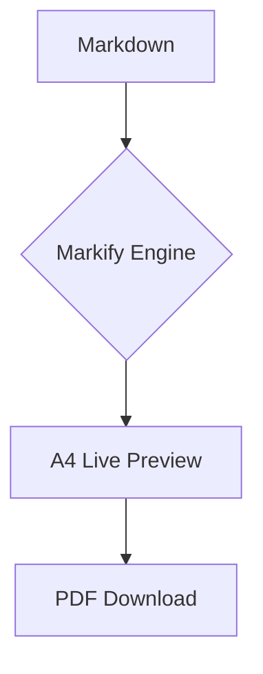

# Landing Page

- **University:** [University Name]
- **Program:** [Your Degree Program]
- **Title:** [Assignment Title]
- **Subtitle:** [Course Code & Assessment Name]
- **Course:** [Course Full Name]
- **Name:** [Your Name]
- **Roll No:** [Your Roll Number]
- **Reg. No:** [Your Registration Number]
- **Batch:** [Your Batch]
- **Submission Date:** [Month Day, Year]

\pagebreak

# Table of Contents
1. [Welcome to Markify](#1-welcome-to-markify)
2. [Editor Page: Your Workspace](#2-editor-page-your-workspace)
   - [2.1 File Explorer & Navigation](#21-file-explorer--navigation)
   - [2.2 Real-time Search & Selection](#22-real-time-search--selection)
   - [2.3 Global Reset System](#23-global-reset-system)
3. [Converter Page: Production Engine](#3-converter-page-production-engine)
   - [3.1 Multi-Mode Uploading](#31-multi-mode-uploading)
   - [3.2 Live Preview & Zoom Scale](#32-live-preview--zoom-scale)
   - [3.3 Sorting & Organization](#33-sorting--organization)
   - [3.4 Final PDF Compression](#34-final-pdf-compression)
4. [Mastering Markdown Syntax](#4-mastering-markdown-syntax)
   - [4.1 The Individual Landing Page](#41-the-individual-landing-page)
   - [4.2 Navigational Table of Contents](#42-navigational-table-of-contents)
   - [4.3 Explicit Page Breaks (\pagebreak)](#43-explicit-page-breaks-pagebreak)
   - [4.4 Mermaid Diagrams](#44-mermaid-diagrams)
5. [Summary](#5-summary)

\pagebreak

## 1. Welcome to Markify
Markify is an advanced Markdown-to-PDF ecosystem designed for academics and professionals. It provides a seamless transition from raw Markdown to production-ready academic reports.

---

## 2. Editor Page: Your Workspace
The Editor page is your command center for content creation.

### **2.1 File Explorer & Navigation**
The sidebar allows you to manage multiple files. You can create subfolders to keep your research and final drafts organized. All content is auto-saved locally.

### **2.2 Real-time Search & Selection**
Instantly find any file using the search bar. Use **Selection Mode** (the checkbox icon) to select multiple files for batch deletion, keeping your workspace clean.

### **2.3 Global Reset System**
The **Reset Button** in the sidebar is a safety feature. Clicking it will purge all your local drafts and restore these original instruction guides to the editor.

\pagebreak

## 3. Converter Page: Production Engine
The Converter page is where your markdown files are transformed into high-fidelity A4 PDFs.

### **3.1 Multi-Mode Uploading**
You can upload individual `.md` files, entire folder structures, or even a single `.zip` archive. Markify handles the extraction and mapping automatically.

### **3.2 Live Preview & Zoom Scale**
Inspect your document before downloading. The live preview represents exact A4 dimensions. Use the **Zoom Slider** (50% to 200%) to perform detailed quality checks on fine text and diagrams.

### **3.3 Sorting & Organization**
Arrange your files using the sort dropdown. You can sort by **Name**, **File Size**, or **Upload Time** to ensure your multi-file projects are combined in the correct sequence.

### **3.4 Final PDF Export**
Once you are satisfied with the preview, the **Download Button** generates a professional PDF with embedded links, graphics, and high-quality typography.

\pagebreak

## 4. Mastering Markdown Syntax
To unlock the full potential of Markify, use these specialized syntax features.

### **4.1 The Individual Landing Page**
Markify can **automatically create a cover page** for you! Just start your file with `# Landing Page` followed by a simple list like this:
- `University`, `Program`, `Title`, `Subtitle`, `Course`, `Name`, `Roll No`, `Reg. No`, `Batch`, `Submission Date`.

The application scans these keywords and places them into a beautiful, professional layout at the very beginning of your PDF. Since this is an **Individual Submission**, it is designed to highlight your details clearly.

### **4.2 Navigational Table of Contents**
Creating a `# Table of Contents` section with internal links generates a clickable TOC in the final PDF. For example: `[Welcome](#1-welcome-to-markify)`.

### **4.3 Explicit Page Breaks (\pagebreak)**
The `\pagebreak` tag is a crucial feature. It forces the PDF generator to start a new page immediately, allowing you to perfectly separate your cover, TOC, and chapters.

### **4.4 Mermaid Diagrams**
Visualize complex logic without external images using Mermaid blocks:

---

## 5. Summary
Markify streamlines the reporting process by combining a robust file system with a powerful rendering engine. By mastering these features, you can focus on your research while Markify handles the aesthetics.
